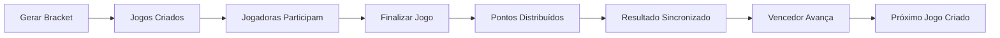

# 🏆 Guia Rápido: Sistema de Torneios e Chaveamento

## 📌 Visão Geral

Sistema completo de torneios com chaveamento automático para a API Passa Bola. Suporta:
- **Torneios de Copa** (ORGANIZATION) - Chaveamento obrigatório
- **Torneios de Campeonato** (PLAYER) - Chaveamento opcional
- Geração aleatória de chaves
- Eliminação simples
- Avanço automático de vencedores

---

## 🎯 Casos de Uso

### 1. Copa Oficial (Organization)
Uma organização quer criar um torneio oficial de copa com 8 times.

**Fluxo:**
1. Organization cria torneio (maxTeams: 8)
2. Líderes de times inscrevem seus times
3. Quando 8 times estiverem inscritos, organization gera o chaveamento
4. Sistema cria automaticamente: 4 quartas + 2 semis + 1 final
5. Organization atualiza resultados conforme jogos acontecem
6. Vencedores avançam automaticamente
7. Campeão é definido após a final

### 2. Campeonato Regional (Player)
Uma jogadora quer organizar um campeonato entre times locais.

**Fluxo:**
1. Player cria torneio (maxTeams: 16)
2. Times se inscrevem
3. Player gera chaveamento quando tiver número adequado de times
4. Sistema gerencia automaticamente o bracket
5. Resultados são atualizados e times avançam

---

## 🔧 Componentes Implementados

### Entidades

#### **Tournament**
- Gerencia o torneio completo
- Campos: name, gameType, creatorId, status, maxTeams, totalTeams
- Status: REGISTRATION → BRACKET_READY → IN_PROGRESS → FINISHED

#### **TournamentTeam**
- Relaciona times com torneios
- Campos: tournament, team, seedPosition, status
- Status: REGISTERED → CONFIRMED → ELIMINATED/CHAMPION/RUNNER_UP

#### **TournamentMatch**
- Representa cada partida do chaveamento
- Campos: tournament, round, team1, team2, winner, nextMatchId
- Status: PENDING → SCHEDULED → IN_PROGRESS → FINISHED

### Repositories

- **TournamentRepository**: Queries para torneios
- **TournamentTeamRepository**: Gerencia inscrições de times
- **TournamentMatchRepository**: Gerencia partidas do bracket

### Service

**TournamentService** - Lógica principal:
- `createTournament()`: Cria novo torneio
- `registerTeam()`: Inscreve time no torneio
- `generateBracket()`: Gera chaveamento aleatório
- `updateMatchResult()`: Atualiza resultado e avança vencedor
- `advanceWinner()`: Move vencedor para próxima rodada
- `checkTournamentCompletion()`: Verifica se torneio terminou

### DTOs

**Requests:**
- `TournamentRequest`: Criar torneio
- `MatchResultRequest`: Atualizar resultado

**Responses:**
- `TournamentResponse`: Dados completos do torneio
- `TournamentTeamResponse`: Time inscrito
- `TournamentMatchResponse`: Partida do bracket

### Controller

**TournamentController** - Endpoints REST:
- `POST /api/tournaments`: Criar torneio
- `POST /api/tournaments/{id}/register/{teamId}`: Inscrever time
- `POST /api/tournaments/{id}/generate-bracket`: Gerar chaveamento
- `PATCH /api/tournaments/matches/{id}/result`: Atualizar resultado
- `GET /api/tournaments`: Listar torneios
- `GET /api/tournaments/{id}`: Detalhes do torneio
- `GET /api/tournaments/{id}/teams`: Times inscritos
- `GET /api/tournaments/{id}/matches`: Todas as partidas
- `GET /api/tournaments/{id}/matches/round/{round}`: Partidas por rodada

---

## 🎲 Algoritmo de Chaveamento

### Processo de Geração

1. **Validação**
   - Verifica se número de times é potência de 2
   - Mínimo de 2 times
   - Chaveamento ainda não gerado

2. **Embaralhamento Aleatório**
   ```java
   Collections.shuffle(teams, new Random());
   ```

3. **Atribuição de Seeds**
   - Times recebem posições 1, 2, 3, 4... aleatoriamente

4. **Criação de Rodadas**
   - Calcula número de rodadas necessárias
   - Cria partidas de todas as rodadas
   - Primeira rodada: times definidos
   - Rodadas seguintes: aguardam vencedores

5. **Conexão de Partidas**
   - Cada partida sabe qual é a próxima (`nextMatchId`)
   - Vencedores avançam automaticamente

### Estrutura do Bracket

**8 Times:**
```
QUARTAS (4 partidas)
├─ Match 1: Time 1 vs Time 2 → Vencedor vai para Semi 1
├─ Match 2: Time 3 vs Time 4 → Vencedor vai para Semi 1
├─ Match 3: Time 5 vs Time 6 → Vencedor vai para Semi 2
└─ Match 4: Time 7 vs Time 8 → Vencedor vai para Semi 2

SEMIS (2 partidas)
├─ Match 5: Vencedor M1 vs Vencedor M2 → Vencedor vai para Final
└─ Match 6: Vencedor M3 vs Vencedor M4 → Vencedor vai para Final

FINAL (1 partida)
└─ Match 7: Vencedor M5 vs Vencedor M6 → Campeão!
```

---

## 📊 Rodadas por Número de Times

| Times | Rodadas Criadas | Total de Partidas |
|-------|-----------------|-------------------|
| 2 | FINAL | 1 |
| 4 | SEMI → FINAL | 3 |
| 8 | QUARTER → SEMI → FINAL | 7 |
| 16 | ROUND_OF_16 → QUARTER → SEMI → FINAL | 15 |
| 32 | ROUND_OF_32 → ... → FINAL | 31 |

**Fórmula:** Total de partidas = N - 1 (onde N = número de times)

---

## 🔐 Permissões e Validações

### Criar Torneio
- ✅ ORGANIZATION: pode criar CUP e CHAMPIONSHIP
- ✅ PLAYER: pode criar apenas CHAMPIONSHIP
- ✅ maxTeams é ajustado para próxima potência de 2

### Inscrever Time
- ✅ Apenas líder do time pode inscrever
- ✅ Torneio deve estar em REGISTRATION
- ✅ Não pode exceder maxTeams
- ✅ Time não pode estar já inscrito

### Gerar Chaveamento
- ✅ Apenas criador do torneio
- ✅ Número de times deve ser potência de 2
- ✅ Mínimo 2 times
- ✅ Chaveamento não pode ter sido gerado antes

### Atualizar Resultado
- ✅ Apenas criador do torneio
- ✅ Partida deve ter ambos os times definidos
- ✅ Vencedor avança automaticamente

---

## 💡 Exemplos de Uso

### Criar Torneio de Copa (8 times)

```bash
# 1. Organization cria torneio
curl -X POST http://localhost:8080/api/tournaments \
  -H "Authorization: Bearer $ORG_TOKEN" \
  -H "Content-Type: application/json" \
  -d '{
    "name": "Copa Passa Bola 2025",
    "gameType": "CUP",
    "venue": "Estádio Municipal",
    "maxTeams": 8
  }'

# 2. Líderes inscrevem times (repetir para 8 times)
curl -X POST http://localhost:8080/api/tournaments/1/register/10 \
  -H "Authorization: Bearer $PLAYER_TOKEN"

# 3. Gerar chaveamento (quando 8 times inscritos)
curl -X POST http://localhost:8080/api/tournaments/1/generate-bracket \
  -H "Authorization: Bearer $ORG_TOKEN"

# 4. Ver chaveamento completo
curl http://localhost:8080/api/tournaments/1

# 5. Atualizar resultado de uma partida
curl -X PATCH http://localhost:8080/api/tournaments/matches/1/result \
  -H "Authorization: Bearer $ORG_TOKEN" \
  -H "Content-Type: application/json" \
  -d '{
    "team1Score": 3,
    "team2Score": 1
  }'

# 6. Ver partidas das quartas
curl http://localhost:8080/api/tournaments/1/matches/round/QUARTER

# 7. Ver partidas das semis
curl http://localhost:8080/api/tournaments/1/matches/round/SEMI

# 8. Ver final
curl http://localhost:8080/api/tournaments/1/matches/round/FINAL
```

---

## 🎯 Próximas Melhorias Possíveis

### Funcionalidades Futuras
- [ ] Sistema de pênaltis para empates
- [ ] Chaveamento com cabeças de chave (seeding inteligente)
- [ ] Torneios de pontos corridos
- [ ] Fase de grupos + mata-mata
- [ ] Terceiro lugar (disputa)
- [ ] Estatísticas do torneio
- [ ] Bracket visual (SVG/Canvas)
- [ ] Notificações de avanço de rodada
- [ ] Integração com sistema de jogos (criar Game automaticamente)
- [ ] Histórico de torneios por time
- [ ] Rankings de times baseados em torneios

### Melhorias Técnicas
- [ ] Cache de brackets gerados
- [ ] Validação de conflitos de horário
- [ ] Sistema de repescagem
- [ ] Torneios multi-fase
- [ ] Exportação de brackets (PDF/PNG)

---

## 📝 Notas Técnicas

### Potências de 2
O sistema requer número de times em potência de 2 para garantir um bracket balanceado:
- 2, 4, 8, 16, 32, 64...
- Se maxTeams não for potência de 2, é ajustado automaticamente para a próxima

### Aleatoriedade
- `Collections.shuffle()` com `Random()` padrão
- Para torneios oficiais, pode-se usar `SecureRandom` para maior imprevisibilidade
- Seeds são atribuídos após embaralhamento

### Transações
- Geração de bracket é transacional
- Se falhar, nenhuma partida é criada
- Atualização de resultado avança vencedor na mesma transação

### Performance
- Queries otimizadas com índices em tournament_id
- Eager loading de teams em partidas quando necessário
- Paginação em listagens

---

## 🐛 Troubleshooting

### "Número de times deve ser potência de 2"
**Causa:** Tentou gerar bracket com 3, 5, 6, 7, 9... times  
**Solução:** Aguarde até ter 2, 4, 8, 16 ou 32 times inscritos

### "Chaveamento já foi gerado"
**Causa:** Tentou gerar bracket novamente  
**Solução:** Não é possível regenerar. Crie novo torneio se necessário

### "Partida ainda não tem ambos os times definidos"
**Causa:** Tentou atualizar resultado de partida PENDING  
**Solução:** Aguarde partidas anteriores serem finalizadas

### "Apenas o criador pode gerar chaveamento"
**Causa:** Usuário diferente do criador tentou gerar  
**Solução:** Use token do usuário que criou o torneio

---

## 🔗 Integração com Sistema de Jogos

### Como Funciona

Cada `TournamentMatch` cria automaticamente um `Game` do tipo **CHAMPIONSHIP**:

1. **Geração do Bracket**: Quando o chaveamento é gerado, jogos são criados para a primeira rodada
2. **Avanço de Vencedores**: Quando um time vence, o jogo da próxima rodada é criado automaticamente
3. **Finalização**: Use o endpoint existente de finalização de jogos
4. **Sincronização**: Resultado é sincronizado automaticamente com o torneio

### Fluxo Completo



### Finalizar Jogo de Torneio

Use o endpoint existente de finalização:

```bash
POST /api/games/{gameId}/finish
Authorization: Bearer $CREATOR_TOKEN
Content-Type: application/json

{
  "homeGoals": 3,
  "awayGoals": 1,
  "goals": [
    {
      "playerId": 10,
      "teamSide": 1,
      "minute": 15,
      "isOwnGoal": false
    },
    {
      "playerId": 12,
      "teamSide": 1,
      "minute": 34,
      "isOwnGoal": false
    },
    {
      "playerId": 10,
      "teamSide": 1,
      "minute": 67,
      "isOwnGoal": false
    },
    {
      "playerId": 25,
      "teamSide": 2,
      "minute": 89,
      "isOwnGoal": false
    }
  ],
  "notes": "Ótimo jogo!"
}
```

**O que acontece automaticamente:**
1. ✅ Jogo é finalizado
2. ✅ Gols são registrados para cada jogadora
3. ✅ **Pontos de ranking são distribuídos** para as jogadoras
4. ✅ Resultado é sincronizado com a partida do torneio
5. ✅ Vencedor avança para próxima rodada
6. ✅ Próximo jogo é criado automaticamente

### Vantagens da Integração

- **Ranking Automático**: Jogadoras ganham pontos em cada partida do torneio
- **Estatísticas Completas**: Gols, assistências, tudo registrado
- **Sistema Unificado**: Usa toda a infraestrutura existente de jogos
- **Participação de Jogadoras**: Times podem convidar jogadoras para cada partida
- **Espectadores**: Sistema de espectadores funciona normalmente

### Buscar Jogo de uma Partida

Cada `TournamentMatchResponse` inclui o `gameId`:

```json
{
  "id": 1,
  "tournamentId": 1,
  "round": "QUARTER",
  "team1Id": 10,
  "team1Name": "Estrelas FC",
  "team2Id": 15,
  "team2Name": "Vitória SC",
  "status": "SCHEDULED",
  "gameId": 42  // ← ID do jogo criado automaticamente
}
```

Use esse `gameId` para:
- Ver detalhes do jogo: `GET /api/games/{gameId}`
- Finalizar o jogo: `POST /api/games/{gameId}/finish`
- Ver participantes: `GET /api/game-participants/game/{gameId}`

---

## ✅ Status da Implementação

- ✅ Entidades criadas (Tournament, TournamentTeam, TournamentMatch)
- ✅ Repositories implementados
- ✅ Service com lógica completa de chaveamento
- ✅ Controller com todos os endpoints
- ✅ DTOs de request e response
- ✅ Validações de negócio
- ✅ Geração aleatória de chaves
- ✅ Avanço automático de vencedores
- ✅ Detecção de campeão
- ✅ **Integração completa com sistema de jogos**
- ✅ **Criação automática de jogos para cada partida**
- ✅ **Sincronização automática de resultados**
- ✅ **Distribuição de pontos de ranking**
- ✅ Compilação 100% bem-sucedida (160 arquivos)
- ✅ Documentação completa no README.md

**Sistema totalmente integrado e pronto para uso em produção!** 🚀
