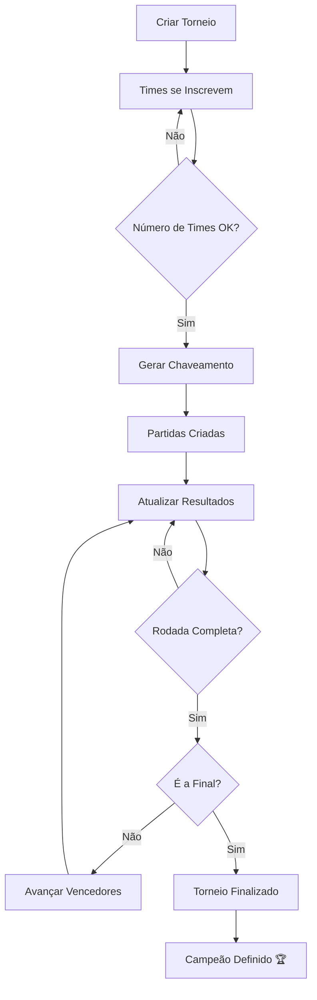

# 🏆 API Passa Bola - Documentação Completa

> API REST completa para plataforma de futebol feminino com sistema de jogadoras, organizações, espectadores, times, jogos e interações sociais.

## 📋 Índice

- [🚀 Configuração Inicial](#-configuração-inicial)
- [🏗️ Arquitetura da API](#️-arquitetura-da-api)
- [🔐 Autenticação e Autorização](#-autenticação-e-autorização)
- [⚽ Sistema de Jogos](#-sistema-de-jogos)
- [🏁 Finalização de Jogos](#-finalização-de-jogos)
- [🏆 Sistema de Ranking e Pontos](#-sistema-de-ranking-e-pontos)
- [👥 Sistema de Times](#-sistema-de-times)
- [🏆 Sistema de Torneios e Chaveamento](#-sistema-de-torneios-e-chaveamento)
- [🤝 Sistema de Seguimento](#-sistema-de-seguimento)
- [📝 Sistema de Posts](#-sistema-de-posts)
- [📁 Sistema de Upload de Arquivos (Azure Blob Storage)](#-sistema-de-upload-de-arquivos-azure-blob-storage)
- [🎬 Sistema de Vídeos de Jogos](#-sistema-de-vídeos-de-jogos)
- [💬 Sistema de Chat](#-sistema-de-chat)
- [🔔 Sistema de Notificações](#-sistema-de-notificações-em-tempo-real)
- [📡 Endpoints da API](#-endpoints-da-api)
- [💡 Exemplos Práticos](#-exemplos-práticos)
- [🔧 Troubleshooting](#-troubleshooting)

---

## 🚀 Configuração Inicial

### Pré-requisitos
- **Java 21+**
- **MySQL 8.0+** (ou H2 para testes)
- **Maven 3.6+**
- **Postman** ou ferramenta similar

### 1. Configurar Banco de Dados

#### MySQL (Produção)
```sql
-- Criar banco de dados
CREATE DATABASE api_passa_bola;
CREATE USER 'api_user'@'localhost' IDENTIFIED BY 'senha123';
GRANT ALL PRIVILEGES ON api_passa_bola.* TO 'api_user'@'localhost';
FLUSH PRIVILEGES;
```

#### H2 (Desenvolvimento)
```properties
# application-dev.properties
spring.datasource.url=jdbc:h2:mem:testdb
spring.datasource.username=sa
spring.datasource.password=
spring.h2.console.enabled=true
spring.jpa.database-platform=org.hibernate.dialect.H2Dialect
```

### 2. Configurar Variáveis de Ambiente
```bash
export DB_USER=api_user
export DB_PASSWORD=senha123
export JWT_SECRET=minha_chave_secreta_super_segura
```

### 3. Executar a Aplicação
```bash
# Compilar
./mvnw clean compile

# Executar
./mvnw spring-boot:run

# Ou com perfil específico
./mvnw spring-boot:run -Dspring-boot.run.profiles=dev
```

**🌐 Aplicação disponível em:** `http://localhost:8080`

---

## 🏗️ Arquitetura da API

### Entidades Principais (Estrutura Flattened)

#### 👩‍⚽ Player (Jogadora)
```json
{
  "id": 1,
  "userType": "PLAYER",
  "username": "maria_silva",
  "name": "Maria Silva",
  "email": "maria@email.com",
  "bio": "Atacante profissional",
  "followers": 150,
  "following": 75,
  "birthDate": "1995-03-15",
  "profilePhotoUrl": "https://example.com/photo.jpg",
  "bannerUrl": "https://example.com/banner.jpg",
  "organizationId": 1,
  "pastOrganization": "Santos FC",
  "phone": "(11) 99999-9999"
}
```

#### 🏟️ Organization (Time/Organização)
```json
{
  "id": 1,
  "userType": "ORGANIZATION",
  "username": "santos_fc",
  "name": "Santos FC Feminino",
  "email": "contato@santos.com",
  "cnpj": "12345678000199",
  "bio": "Time tradicional de futebol feminino",
  "followers": 5000,
  "following": 200,
  "city": "Santos",
  "state": "SP",
  "profilePhotoUrl": "https://example.com/logo.jpg",
  "bannerUrl": "https://example.com/banner.jpg",
  "phone": "(13) 3333-3333"
}
```

#### 👥 Spectator (Espectador)
```json
{
  "id": 1,
  "userType": "SPECTATOR",
  "username": "joao_torcedor",
  "name": "João Santos",
  "email": "joao@email.com",
  "bio": "Apaixonado pelo futebol feminino",
  "followers": 50,
  "following": 100,
  "birthDate": "1988-07-20",
  "phone": "(11) 88888-8888",
  "profilePhotoUrl": "https://example.com/photo.jpg",
  "bannerUrl": "https://example.com/banner.jpg",
  "favoriteTeamId": 1
}
```

#### 🏆 Team (Time de Jogadoras)
```json
{
  "id": 1,
  "nameTeam": "Estrelas FC",
  "leader": {
    "id": 10,
    "username": "maria_silva",
    "name": "Maria Silva"
  },
  "players": [
    {"id": 10, "name": "Maria Silva"},
    {"id": 20, "name": "Ana Costa"},
    {"id": 30, "name": "Julia Santos"}
  ],
  "playerCount": 3,
  "createdAt": "2024-12-01T10:00:00"
}
```

---

## 🔐 Autenticação e Autorização

### Sistema JWT
Todos os endpoints protegidos requerem:
```http
Authorization: Bearer <jwt_token>
```

### Roles Disponíveis
- **PLAYER**: Jogadoras
- **ORGANIZATION**: Times/Organizações  
- **SPECTATOR**: Espectadores/Torcedores

### Fluxo de Autenticação

#### 1. Registro de Jogadora
```http
POST /api/auth/register/player
Content-Type: application/json

{
  "username": "maria_silva",
  "name": "Maria Silva",
  "email": "maria@email.com",
  "password": "senha123",
  "bio": "Atacante profissional",
  "birthDate": "1995-03-15",
  "profilePhotoUrl": "https://example.com/photo.jpg",
  "bannerUrl": "https://example.com/banner.jpg",
  "organizationId": 1,
  "pastOrganization": "Santos FC",
  "phone": "(11) 99999-9999"
}
```

#### 2. Registro de Organização
```http
POST /api/auth/register/organization
Content-Type: application/json

{
  "username": "santos_fc",
  "name": "Santos FC Feminino",
  "email": "contato@santos.com",
  "cnpj": "12345678000199",
  "password": "senha123",
  "bio": "Time tradicional de futebol feminino",
  "city": "Santos",
  "state": "SP",
  "profilePhotoUrl": "https://example.com/logo.jpg",
  "bannerUrl": "https://example.com/banner.jpg",
  "phone": "(13) 3333-3333"
}
```

#### 3. Registro de Espectador
```http
POST /api/auth/register/spectator
Content-Type: application/json

{
  "username": "joao_torcedor",
  "name": "João Santos",
  "email": "joao@email.com",
  "password": "senha123",
  "bio": "Apaixonado pelo futebol feminino",
  "birthDate": "1988-07-20",
  "phone": "(11) 88888-8888",
  "profilePhotoUrl": "https://example.com/photo.jpg",
  "bannerUrl": "https://example.com/banner.jpg",
  "favoriteTeamId": 1
}
```

#### 4. Login (Email-based)
```http
POST /api/auth/login
Content-Type: application/json

{
  "email": "maria@email.com",
  "password": "senha123"
}
```

**Resposta:**
```json
{
  "token": "eyJhbGciOiJIUzI1NiJ9...",
  "userType": "PLAYER",
  "profileId": 1,
  "username": "maria_silva"
}
```

> **⚠️ Importante:** O sistema usa **email** para login, não username. O token JWT contém as informações do usuário autenticado.

---

## ⚽ Sistema de Jogos

O sistema suporta **3 tipos distintos** de jogos, cada um com suas próprias regras:

### Tipos de Jogos

| Tipo | Criador | Participação | Estrutura |
|------|---------|--------------|-----------|
| **FRIENDLY** (Amistoso) | PLAYER | Individual ou Time | Informal, flexível |
| **CHAMPIONSHIP** (Campeonato) | PLAYER | Individual ou Time | Competitivo, organizado |
| **CUP** (Copa) | ORGANIZATION | Apenas Times Oficiais | Formal, com convites |

---

### 🎯 Regras de Criação de Jogos

#### **Configurações Obrigatórias:**

1. **Sistema de Espectadores:**
   - `hasSpectators`: true/false
   - Se `true`, campo `maxSpectators` é **opcional**
   - Se não informado, **padrão é 5** (mínimo)
   - Se informado, `maxSpectators` deve ser **no mínimo 5**

2. **Limites de Jogadoras:**
   - **Mínimo:** 6 jogadoras (3x3)
   - **Máximo:** 22 jogadoras (11x11)
   - **Números pares obrigatórios** para times balanceados

3. **Times Balanceados:**
   - Jogo só pode começar se:
     - Atingir mínimo de jogadoras
     - Ter **exatamente o mesmo número** em cada lado

4. **Time Completo no Mesmo Lado:**
   - Quando um time entra, **TODAS as integrantes** vão para o **MESMO lado**

---

### 1️⃣ Jogos Amistosos (FRIENDLY)

#### **Características:**
- Criados por **jogadoras** (PLAYER)
- Participação individual ou com time
- Estrutura flexível e informal
- Ideal para treinos e jogos casuais

#### **Criar Jogo Amistoso:**
```http
POST /api/games/friendly
Authorization: Bearer <token_player>
Content-Type: application/json

{
  "gameName": "Pelada do Sábado",
  "gameDate": "2025-10-15T14:00:00",
  "venue": "Campo do Parque",
  "description": "Jogo 5x5 com torcida",
  "hasSpectators": true,
  "maxSpectators": 20,
  "minPlayers": 10,
  "maxPlayers": 22
}
```

**Response:**
```json
{
  "id": 123,
  "gameType": "FRIENDLY",
  "gameName": "Pelada do Sábado",
  "hostUsername": "maria_silva",
  "hostId": 10,
  "gameDate": "2025-10-15T14:00:00",
  "venue": "Campo do Parque",
  "description": "Jogo 5x5 com torcida",
  "hasSpectators": true,
  "minPlayers": 10,
  "maxPlayers": 22,
  "maxSpectators": 20,
  "currentSpectatorCount": 0,
  "currentPlayerCount": 0,
  "team1Count": 0,
  "team2Count": 0,
  "isTeamsBalanced": true,
  "canStart": false,
  "status": "SCHEDULED",
  "homeGoals": 0,
  "awayGoals": 0,
  "team1Players": [],
  "team2Players": [],
  "createdAt": "2025-10-06T23:00:00"
}
```

> **💡 Nota:** `hostUsername` e `hostId` são extraídos automaticamente do JWT token. Não é necessário enviar no request.

---

### 2️⃣ Jogos de Campeonato (CHAMPIONSHIP)

#### **Características:**
- Criados por **jogadoras** (PLAYER)
- Mesma estrutura dos amistosos
- Diferenciados apenas pelo tipo
- Ideal para competições organizadas

#### **Criar Jogo de Campeonato:**
```http
POST /api/games/championship
Authorization: Bearer <token_player>
Content-Type: application/json

{
  "gameName": "Campeonato Regional - Fase 1",
  "gameDate": "2025-11-20T16:00:00",
  "venue": "Estádio Municipal",
  "description": "Primeira fase do campeonato",
  "hasSpectators": true,
  "maxSpectators": 50,
  "minPlayers": 22,
  "maxPlayers": 22
}
```

---

### 3️⃣ Jogos de Copa (CUP)

#### **Características:**
- Criados por **organizações** (ORGANIZATION)
- Apenas times oficiais (Organizations)
- Sistema formal de convites
- Estrutura profissional

#### **Criar Jogo de Copa:**
```http
POST /api/games/cup
Authorization: Bearer <token_organization>
Content-Type: application/json

{
  "homeTeamId": 10,
  "awayTeamId": 20,
  "gameDate": "2025-12-05T19:00:00",
  "venue": "Arena Central",
  "championship": "Copa Nacional Feminina",
  "round": "Quartas de Final"
}
```

**Response:**
```json
{
  "id": 456,
  "gameType": "CUP",
  "homeTeam": {
    "id": 10,
    "name": "Santos FC Feminino",
    "logoUrl": "https://..."
  },
  "awayTeam": {
    "id": 20,
    "name": "Corinthians Feminino",
    "logoUrl": "https://..."
  },
  "gameDate": "2025-12-05T19:00:00",
  "venue": "Arena Central",
  "championship": "Copa Nacional Feminina",
  "round": "Quartas de Final",
  "status": "SCHEDULED",
  "homeGoals": 0,
  "awayGoals": 0
}
```

---

### 🎮 Sistema de Participação em Jogos

#### **Para Jogos FRIENDLY e CHAMPIONSHIP:**

Jogadoras podem entrar de **2 formas**:

##### **1. Individual (INDIVIDUAL)**
```http
POST /api/game-participants/join
Authorization: Bearer <token_player>
Content-Type: application/json

{
  "gameId": 123,
  "participationType": "INDIVIDUAL",
  "teamSide": 1
}
```

**Resultado:** Apenas a jogadora é adicionada ao Time 1

##### **2. Com Time Completo (WITH_TEAM)**
```http
POST /api/game-participants/join
Authorization: Bearer <token_player>
Content-Type: application/json

{
  "gameId": 123,
  "participationType": "WITH_TEAM",
  "teamSide": 2
}
```

**Resultado:** **TODAS as integrantes do time** são adicionadas ao Time 2

> **⚠️ Importante:** 
> - `teamSide` é **obrigatório** (1 ou 2)
> - Jogadora **escolhe** qual lado quer entrar
> - Com `WITH_TEAM`, todas as integrantes vão para o **mesmo lado**

#### **Validações de Participação:**

✅ Jogo não pode ter começado  
✅ Jogadora não pode estar duplicada  
✅ Não pode exceder máximo de jogadoras  
✅ `teamSide` deve ser 1 ou 2  
✅ Com `WITH_TEAM`, jogadora deve ter time cadastrado  

#### **Sair de um Jogo:**
```http
DELETE /api/game-participants/leave/{gameId}
Authorization: Bearer <token_player>
```

**Comportamento:**
- **INDIVIDUAL:** Remove apenas a jogadora
- **WITH_TEAM:** Remove **TODAS as integrantes do time**

#### **Ver Participantes:**
```http
# Listar todas as participantes do jogo
GET /api/game-participants/game/{gameId}

# Minhas participações
GET /api/game-participants/my-participations?page=0&size=20
Authorization: Bearer <token_player>

# Participações de uma jogadora específica
GET /api/game-participants/player/{playerId}?page=0&size=20
```

---

### 👥 Sistema de Espectadores em Jogos

#### **Para Jogos FRIENDLY e CHAMPIONSHIP:**

Espectadores podem se inscrever para assistir jogos que aceitam público.

#### **Confirmar Presença como Espectador:**
```http
POST /api/games/{id}/spectate
Authorization: Bearer <token_spectator>
```

**Validações:**
- ✅ Apenas usuários SPECTATOR podem se inscrever
- ✅ Jogo deve ter `hasSpectators = true`
- ✅ Apenas jogos FRIENDLY e CHAMPIONSHIP aceitam espectadores
- ✅ Não pode exceder `maxSpectators` (mínimo 5 quando habilitado)
- ✅ Não pode se inscrever duas vezes no mesmo jogo

**Response:**
```json
{
  "id": 789,
  "gameId": 123,
  "gameName": "Pelada do Sábado",
  "spectatorId": 45,
  "spectatorUsername": "joao_torcedor",
  "spectatorName": "João Santos",
  "status": "CONFIRMED",
  "joinedAt": "2025-10-07T14:30:00",
  "createdAt": "2025-10-07T14:30:00"
}
```

#### **Cancelar Presença:**
```http
DELETE /api/games/{id}/spectate
Authorization: Bearer <token_spectator>
```

#### **Ver Espectadores de um Jogo:**
```http
# Lista de espectadores confirmados (público)
GET /api/games/{id}/spectators

# Contagem de espectadores
GET /api/games/{id}/spectators/count

# Verificar se estou inscrito
GET /api/games/{id}/spectators/is-subscribed
Authorization: Bearer <token_spectator>
```

#### **Meus Jogos Inscritos:**
```http
GET /api/games/spectators/my-subscriptions?page=0&size=20
Authorization: Bearer <token_spectator>
```

**Response:**
```json
{
  "content": [
    {
      "id": 789,
      "gameId": 123,
      "gameName": "Pelada do Sábado",
      "spectatorId": 45,
      "spectatorUsername": "joao_torcedor",
      "spectatorName": "João Santos",
      "status": "CONFIRMED",
      "joinedAt": "2025-10-07T14:30:00"
    }
  ],
  "totalElements": 5,
  "totalPages": 1
}
```

#### **Regras de Negócio:**

| Regra | Descrição |
|-------|-----------|
| **Tipo de Usuário** | Apenas SPECTATOR pode se inscrever como espectador |
| **Tipo de Jogo** | Apenas FRIENDLY e CHAMPIONSHIP aceitam espectadores |
| **Habilitação** | Jogo deve ter `hasSpectators = true` |
| **Limite Mínimo** | Quando habilitado, mínimo de 5 espectadores |
| **Limite Máximo** | Definido pelo criador do jogo (`maxSpectators`) |
| **Duplicação** | Um espectador não pode se inscrever duas vezes |
| **Contagem Automática** | `currentSpectatorCount` atualizado em tempo real |

---

### 📊 Campos de Status do Jogo

Todos os jogos FRIENDLY e CHAMPIONSHIP retornam:

```json
{
  "hasSpectators": true,
  "minPlayers": 10,
  "maxPlayers": 22,
  "maxSpectators": 20,
  "currentSpectatorCount": 0,
  "currentPlayerCount": 8,
  "team1Count": 4,
  "team2Count": 4,
  "isTeamsBalanced": true,
  "canStart": false
}
```

| Campo | Descrição |
|-------|-----------|
| `hasSpectators` | Se o jogo permite espectadores |
| `minPlayers` | Mínimo de jogadoras para começar |
| `maxPlayers` | Máximo de jogadoras permitido |
| `maxSpectators` | Máximo de espectadores permitido (mínimo 5 se habilitado) |
| `currentSpectatorCount` | Total de espectadores confirmados |
| `currentPlayerCount` | Total de jogadoras (team1 + team2) |
| `team1Count` | Jogadoras no Time 1 |
| `team2Count` | Jogadoras no Time 2 |
| `isTeamsBalanced` | Se times têm mesmo número |
| `canStart` | Se pode começar (mínimo + balanceado) |

---

### 🔄 Atualizar Jogos

#### **Atualizar Jogo Amistoso:**
```http
PUT /api/games/friendly/{id}
Authorization: Bearer <token_player>
Content-Type: application/json

{
  "gameName": "Pelada do Sábado - ATUALIZADO",
  "gameDate": "2025-10-15T15:00:00",
  "venue": "Campo do Parque Central",
  "description": "Jogo 5x5 atualizado",
  "homeGoals": 3,
  "awayGoals": 2,
  "status": "FINISHED",
  "notes": "Jogo muito disputado!"
}
```

> **🔒 Validação:** Apenas o **host** (criador) pode atualizar

#### **Atualizar Jogo de Campeonato:**
```http
PUT /api/games/championship/{id}
Authorization: Bearer <token_player>
```
> Mesma estrutura do amistoso

#### **Atualizar Jogo de Copa:**
```http
PUT /api/games/cup/{id}
Authorization: Bearer <token_organization>
Content-Type: application/json

{
  "homeTeamId": 10,
  "awayTeamId": 20,
  "gameDate": "2025-12-05T20:00:00",
  "venue": "Arena Central",
  "championship": "Copa Nacional Feminina",
  "round": "Quartas de Final",
  "homeGoals": 2,
  "awayGoals": 1,
  "status": "FINISHED",
  "notes": "Vitória do time da casa"
}
```

> **🔒 Validação:** Apenas a **organização criadora** pode atualizar

#### **Atualizar Placar:**
```http
PATCH /api/games/{id}/score?homeGoals=3&awayGoals=2
Authorization: Bearer <token>
```

#### **Deletar Jogo:**
```http
DELETE /api/games/{id}
Authorization: Bearer <token>
```

---

### 📋 Consultar Jogos

```http
# Listar todos os jogos
GET /api/games?page=0&size=20

# Buscar por ID
GET /api/games/{id}

# Buscar por tipo
GET /api/games/type/FRIENDLY?page=0&size=20
GET /api/games/type/CHAMPIONSHIP?page=0&size=20
GET /api/games/type/CUP?page=0&size=20

# Buscar por host (jogadora criadora)
GET /api/games/host/{hostId}?page=0&size=20

# Buscar por organização
GET /api/games/organization/{organizationId}?page=0&size=20

# Buscar por status
GET /api/games/status/SCHEDULED?page=0&size=20
GET /api/games/status/LIVE?page=0&size=20
GET /api/games/status/FINISHED?page=0&size=20

# Buscar por campeonato
GET /api/games/championship?championship=Copa%20Nacional&page=0&size=20

# Buscar por período
GET /api/games/date-range?startDate=2025-10-01T00:00:00&endDate=2025-10-31T23:59:59&page=0&size=20
```

---

## 🏁 Finalização de Jogos

### 🎯 Visão Geral

Sistema completo para finalizar jogos com registro de placar e gols das jogadoras. Apenas o **criador do jogo** pode finalizá-lo, e o sistema distribui automaticamente pontos de ranking para jogos de **CHAMPIONSHIP** e **CUP**.

### Características

- ✅ Apenas o **criador** pode finalizar o jogo
- ✅ Registro de **placar** (gols do time 1 e time 2)
- ✅ Registro de **gols individuais** com jogadoras que marcaram
- ✅ Suporte a **gols contra** (own goals)
- ✅ Validação automática: número de gols deve bater com a lista
- ✅ Distribuição automática de **pontos de ranking**
- ✅ Minuto do gol (opcional)
- ✅ Observações sobre o jogo

---

### 🎮 Finalizar Jogo

```http
POST /api/games/{id}/finish
Authorization: Bearer <token>
Content-Type: application/json

{
  "homeGoals": 3,
  "awayGoals": 2,
  "goals": [
    {
      "playerId": 10,
      "teamSide": 1,
      "minute": 15,
      "isOwnGoal": false
    },
    {
      "playerId": 20,
      "teamSide": 1,
      "minute": 32,
      "isOwnGoal": false
    },
    {
      "playerId": 30,
      "teamSide": 2,
      "minute": 45,
      "isOwnGoal": false
    },
    {
      "playerId": 10,
      "teamSide": 1,
      "minute": 67,
      "isOwnGoal": false
    },
    {
      "playerId": 40,
      "teamSide": 2,
      "minute": 80,
      "isOwnGoal": false
    }
  ],
  "notes": "Jogo muito disputado! Ótima atuação de Maria com 2 gols."
}
```

**Campos:**

| Campo | Tipo | Obrigatório | Descrição |
|-------|------|-------------|-----------|
| `homeGoals` | Integer | ✅ | Gols do time 1 (casa) |
| `awayGoals` | Integer | ✅ | Gols do time 2 (fora) |
| `goals` | Array | ❌ | Lista de gols com detalhes |
| `goals[].playerId` | Long | ✅ | ID da jogadora que marcou |
| `goals[].teamSide` | Integer | ✅ | Time (1 ou 2) |
| `goals[].minute` | Integer | ❌ | Minuto do gol |
| `goals[].isOwnGoal` | Boolean | ❌ | Se é gol contra (padrão: false) |
| `notes` | String | ❌ | Observações sobre o jogo |

**Response:**
```json
{
  "id": 123,
  "gameType": "CHAMPIONSHIP",
  "gameName": "Campeonato Regional - Fase 1",
  "hostUsername": "maria_silva",
  "gameDate": "2025-11-20T16:00:00",
  "venue": "Estádio Municipal",
  "status": "FINISHED",
  "homeGoals": 3,
  "awayGoals": 2,
  "result": "3 - 2",
  "isDraw": false,
  "winningTeamSide": 1,
  "team1Players": [...],
  "team2Players": [...],
  "notes": "Jogo muito disputado! Ótima atuação de Maria com 2 gols.",
  "createdAt": "2025-11-15T10:00:00",
  "updatedAt": "2025-11-20T18:00:00"
}
```

---

### ⚽ Consultar Gols

#### **Gols de um Jogo:**
```http
GET /api/goals/game/{gameId}
```

**Response:**
```json
[
  {
    "id": 1,
    "gameId": 123,
    "playerId": 10,
    "playerName": "Maria Silva",
    "playerUsername": "maria_silva",
    "teamSide": 1,
    "minute": 15,
    "isOwnGoal": false,
    "createdAt": "2025-11-20T16:15:00"
  },
  {
    "id": 2,
    "gameId": 123,
    "playerId": 10,
    "playerName": "Maria Silva",
    "playerUsername": "maria_silva",
    "teamSide": 1,
    "minute": 67,
    "isOwnGoal": false,
    "createdAt": "2025-11-20T17:07:00"
  }
]
```

#### **Gols de uma Jogadora:**
```http
GET /api/goals/player/{playerId}
```

#### **Total de Gols de uma Jogadora:**
```http
GET /api/goals/player/{playerId}/count
```

**Response:**
```json
15
```

---

### 🎯 Validações

| Validação | Descrição |
|-----------|-----------|
| **Permissão** | Apenas o criador do jogo pode finalizá-lo |
| **Status** | Jogo não pode estar já finalizado |
| **Contagem** | Número de gols deve bater com a lista de gols |
| **Jogadoras** | Todas as jogadoras devem existir no sistema |
| **Time Side** | Deve ser 1 ou 2 |
| **Gols Negativos** | Não são permitidos |

---

### 📊 Regras de Negócio

#### **Para Jogos FRIENDLY:**
- ✅ Placar é registrado
- ✅ Gols individuais são salvos
- ❌ **NÃO conta para ranking**

#### **Para Jogos CHAMPIONSHIP:**
- ✅ Placar é registrado
- ✅ Gols individuais são salvos
- ✅ **Conta para ranking** (pontos distribuídos automaticamente)

#### **Para Jogos CUP:**
- ✅ Placar é registrado
- ✅ Gols individuais são salvos
- ✅ **Conta para ranking** (pontos distribuídos automaticamente)

---

### 💡 Exemplo Completo

```bash
# 1. Criar jogo de campeonato
curl -X POST http://localhost:8080/api/games/championship \
  -H "Authorization: Bearer <token>" \
  -H "Content-Type: application/json" \
  -d '{
    "gameName": "Final do Campeonato",
    "gameDate": "2025-12-01T15:00:00",
    "venue": "Estádio Central",
    "hasSpectators": true,
    "minPlayers": 22,
    "maxPlayers": 22
  }'

# 2. Jogadoras entram no jogo
curl -X POST http://localhost:8080/api/game-participants/join \
  -H "Authorization: Bearer <token_maria>" \
  -d '{"gameId": 123, "participationType": "INDIVIDUAL", "teamSide": 1}'

# 3. Finalizar jogo com gols
curl -X POST http://localhost:8080/api/games/123/finish \
  -H "Authorization: Bearer <token_criador>" \
  -H "Content-Type: application/json" \
  -d '{
    "homeGoals": 2,
    "awayGoals": 1,
    "goals": [
      {"playerId": 10, "teamSide": 1, "minute": 23},
      {"playerId": 20, "teamSide": 2, "minute": 45},
      {"playerId": 10, "teamSide": 1, "minute": 78}
    ],
    "notes": "Maria fez 2 gols e foi a artilheira!"
  }'

# 4. Ver gols do jogo
curl -X GET http://localhost:8080/api/goals/game/123

# 5. Ver total de gols de Maria
curl -X GET http://localhost:8080/api/goals/player/10/count
```

---

## 🏆 Sistema de Ranking e Pontos

### 🎯 Visão Geral

Sistema completo de gamificação com **rankings**, **divisões** e **pontos** para jogadoras e times. Apenas jogos de **CHAMPIONSHIP** e **CUP** contam para o ranking.

### Características

- 🥇 **7 Divisões** de Bronze a Lendária
- 📊 **Rankings separados** para jogadoras e times
- ⚽ **Sistema de pontos**: Vitória (3), Empate (1), Derrota (0)
- 📈 **Estatísticas completas**: vitórias, derrotas, taxa de vitória, sequências
- 🎮 **Distribuição automática** de pontos após jogos
- 🏅 **Posições globais e por divisão**
- 🔥 **Sequências de vitórias** (streaks)

---

### 🏅 Divisões do Ranking

| Divisão | Pontos | Vitórias Necessárias | Emoji |
|---------|--------|---------------------|-------|
| **Bronze** | 0 - 29 | 0 - 9 | 🥉 |
| **Prata** | 30 - 59 | 10 - 19 | 🥈 |
| **Ouro** | 60 - 99 | 20 - 33 | 🥇 |
| **Platina** | 100 - 149 | 34 - 49 | 💎 |
| **Diamante** | 150 - 199 | 50 - 66 | 💠 |
| **Mestre** | 200 - 299 | 67 - 99 | 👑 |
| **Lendária** | 300+ | 100+ | ⭐ |

---

### 📊 Sistema de Pontuação

O sistema recompensa tanto **vitórias** quanto **desempenho individual** (gols marcados):

| Resultado | Pontos Base | Bônus por Gol | Total |
|-----------|-------------|---------------|-------|
| **Vitória** | +3 | +1 por gol | 3 + gols |
| **Empate** | +1 | +1 por gol | 1 + gols |
| **Derrota** | 0 | +1 por gol | 0 + gols |

#### **Exemplos Práticos:**

| Situação | Cálculo | Pontos Totais |
|----------|---------|---------------|
| Ganhou e fez 3 gols | 3 + 3 | **6 pontos** |
| Ganhou e fez 1 gol | 3 + 1 | **4 pontos** |
| Ganhou sem gols | 3 + 0 | **3 pontos** |
| Empatou e fez 2 gols | 1 + 2 | **3 pontos** |
| Empatou e fez 1 gol | 1 + 1 | **2 pontos** |
| Empatou sem gols | 1 + 0 | **1 ponto** |
| Perdeu e fez 2 gols | 0 + 2 | **2 pontos** |
| Perdeu e fez 1 gol | 0 + 1 | **1 ponto** |
| Perdeu sem gols | 0 + 0 | **0 pontos** |

**Regras:**
- ✅ Apenas jogos **CHAMPIONSHIP** e **CUP** contam
- ❌ Jogos **FRIENDLY** não afetam o ranking
- ✅ Pontos distribuídos automaticamente ao finalizar jogo
- ✅ Jogadoras ganham pontos individuais (base + bônus de gols)
- ✅ Times ganham apenas pontos base (vitória/empate/derrota)
- ⚽ **Gols contra (own goals) NÃO contam para bônus**
- 🎯 **Cada gol marcado vale +1 ponto extra APENAS para a jogadora**
- 👥 **Times NÃO recebem bônus por gols das jogadoras**

---

### 👤 Ranking de Jogadoras

#### **Ver Ranking de uma Jogadora:**
```http
GET /api/rankings/players/{playerId}
```

**Response:**
```json
{
  "id": 1,
  "playerId": 10,
  "playerName": "Maria Silva",
  "playerUsername": "maria_silva",
  "profilePhotoUrl": "https://...",
  "totalPoints": 156,
  "division": "DIAMANTE",
  "divisionName": "Diamante",
  "gamesWon": 45,
  "gamesDrawn": 12,
  "gamesLost": 8,
  "totalGames": 65,
  "winRate": 69.23,
  "currentStreak": 5,
  "bestStreak": 12,
  "globalPosition": 15,
  "divisionPosition": 3,
  "pointsToNextDivision": 44,
  "lastGameDate": "2025-11-20T18:00:00",
  "createdAt": "2025-01-15T10:00:00",
  "updatedAt": "2025-11-20T18:00:00"
}
```

#### **Ranking Global:**
```http
GET /api/rankings/players?page=0&size=50
```

#### **Ranking por Divisão:**
```http
GET /api/rankings/players/division/DIAMANTE?page=0&size=50
GET /api/rankings/players/division/OURO?page=0&size=50
```

#### **Top Jogadoras:**
```http
GET /api/rankings/players/top?size=10
```

#### **Melhores Sequências de Vitórias:**
```http
GET /api/rankings/players/win-streak?size=10
```

#### **Maior Taxa de Vitória:**
```http
GET /api/rankings/players/win-rate?minGames=10&size=10
```

---

### 👥 Ranking de Times

#### **Ver Ranking de um Time:**
```http
GET /api/rankings/teams/{teamId}
```

**Response:**
```json
{
  "id": 1,
  "teamId": 5,
  "teamName": "Estrelas FC",
  "leaderName": "Maria Silva",
  "leaderId": 10,
  "playersCount": 8,
  "totalPoints": 189,
  "division": "DIAMANTE",
  "divisionName": "Diamante",
  "gamesWon": 55,
  "gamesDrawn": 18,
  "gamesLost": 12,
  "totalGames": 85,
  "winRate": 64.71,
  "currentStreak": 7,
  "bestStreak": 15,
  "globalPosition": 8,
  "divisionPosition": 2,
  "pointsToNextDivision": 11,
  "lastGameDate": "2025-11-20T18:00:00",
  "createdAt": "2025-02-10T14:00:00",
  "updatedAt": "2025-11-20T18:00:00"
}
```

#### **Ranking Global de Times:**
```http
GET /api/rankings/teams?page=0&size=50
```

#### **Ranking por Divisão:**
```http
GET /api/rankings/teams/division/MESTRE?page=0&size=50
```

#### **Top Times:**
```http
GET /api/rankings/teams/top?size=10
```

#### **Melhores Sequências:**
```http
GET /api/rankings/teams/win-streak?size=10
```

#### **Maior Taxa de Vitória:**
```http
GET /api/rankings/teams/win-rate?minGames=20&size=10
```

---

### 📈 Estatísticas Rastreadas

#### **Para Jogadoras e Times:**

| Estatística | Descrição |
|-------------|-----------|
| `totalPoints` | Total de pontos acumulados |
| `division` | Divisão atual (BRONZE a LENDARIA) |
| `gamesWon` | Total de vitórias |
| `gamesDrawn` | Total de empates |
| `gamesLost` | Total de derrotas |
| `totalGames` | Total de jogos disputados |
| `winRate` | Taxa de vitória (%) |
| `currentStreak` | Sequência atual de vitórias |
| `bestStreak` | Melhor sequência histórica |
| `globalPosition` | Posição no ranking global |
| `divisionPosition` | Posição na divisão atual |
| `pointsToNextDivision` | Pontos faltando para próxima divisão |
| `lastGameDate` | Data do último jogo |

---

### 🎮 Como Funciona

#### **1. Jogo é Criado:**
```bash
POST /api/games/championship
# Jogo criado com status SCHEDULED
```

#### **2. Jogadoras Participam:**
```bash
POST /api/game-participants/join
# Jogadoras entram individual ou com time
```

#### **3. Jogo é Finalizado:**
```bash
POST /api/games/123/finish
{
  "homeGoals": 3,
  "awayGoals": 2,
  "goals": [...]
}
# Status muda para FINISHED
```

#### **4. Pontos Distribuídos Automaticamente:**
```
✅ JOGADORAS:
   - Time vencedor: +3 pontos base + bônus por gols
   - Time perdedor: 0 pontos base + bônus por gols
   - Empate: +1 ponto base + bônus por gols

✅ TIMES:
   - Recebem apenas pontos base (vitória: 3, empate: 1, derrota: 0)
   - NÃO recebem bônus por gols das jogadoras

✅ Divisões atualizadas automaticamente
✅ Sequências de vitórias atualizadas

Exemplo de Distribuição:
JOGADORAS:
- Maria (Time 1 - vencedor) fez 2 gols: 3 + 2 = 5 pontos
- Ana (Time 1 - vencedor) fez 0 gols: 3 + 0 = 3 pontos
- Julia (Time 2 - perdedor) fez 1 gol: 0 + 1 = 1 ponto
- Carla (Time 2 - perdedor) fez 0 gols: 0 + 0 = 0 pontos

TIMES:
- Time 1 (vencedor): 3 pontos (sem bônus)
- Time 2 (perdedor): 0 pontos (sem bônus)
```

#### **5. Rankings Atualizados:**
```bash
GET /api/rankings/players/10
# Ver novo ranking da jogadora

GET /api/rankings/teams/5
# Ver novo ranking do time
```

---

### 💡 Exemplo Completo

```bash
# 1. Ver ranking atual de Maria
curl -X GET http://localhost:8080/api/rankings/players/10

# Response: 
# { "totalPoints": 153, "division": "DIAMANTE", "gamesWon": 44, ... }

# 2. Maria joga e vence um campeonato fazendo 2 gols
curl -X POST http://localhost:8080/api/games/123/finish \
  -H "Authorization: Bearer <token>" \
  -d '{
    "homeGoals": 3, 
    "awayGoals": 1,
    "goals": [
      {"playerId": 10, "teamSide": 1, "minute": 23},
      {"playerId": 10, "teamSide": 1, "minute": 67},
      {"playerId": 20, "teamSide": 1, "minute": 45},
      {"playerId": 30, "teamSide": 2, "minute": 80}
    ]
  }'

# 3. Ver ranking atualizado
curl -X GET http://localhost:8080/api/rankings/players/10

# Response:
# { "totalPoints": 158, "division": "DIAMANTE", "gamesWon": 45, 
#   "currentStreak": 5, "globalPosition": 15 }
# Maria ganhou: 3 pontos (vitória) + 2 pontos (2 gols) = 5 pontos totais

# 4. Ver top 10 jogadoras
curl -X GET http://localhost:8080/api/rankings/players/top?size=10

# 5. Ver ranking da divisão Diamante
curl -X GET http://localhost:8080/api/rankings/players/division/DIAMANTE

# 6. Ver jogadoras com melhor sequência
curl -X GET http://localhost:8080/api/rankings/players/win-streak?size=10
```

---

### 🎯 Regras de Negócio

| Regra | Descrição |
|-------|-----------|
| **Criação Automática** | Ranking criado automaticamente ao primeiro jogo |
| **Apenas Competitivos** | Só CHAMPIONSHIP e CUP contam |
| **Amistosos Não Contam** | FRIENDLY não afeta ranking |
| **Distribuição Automática** | Pontos dados ao finalizar jogo |
| **Divisão Automática** | Promoção/rebaixamento automático |
| **Sequências** | Streak resetado ao perder |
| **Times** | Pontos só se participou com time |

---

### 📊 Endpoints Disponíveis

#### **Jogadoras:**
- `GET /api/rankings/players/{playerId}` - Ranking individual
- `GET /api/rankings/players` - Ranking global paginado
- `GET /api/rankings/players/division/{division}` - Por divisão
- `GET /api/rankings/players/top` - Top jogadoras
- `GET /api/rankings/players/win-streak` - Melhores sequências
- `GET /api/rankings/players/win-rate` - Maior taxa de vitória

#### **Times:**
- `GET /api/rankings/teams/{teamId}` - Ranking individual
- `GET /api/rankings/teams` - Ranking global paginado
- `GET /api/rankings/teams/division/{division}` - Por divisão
- `GET /api/rankings/teams/top` - Top times
- `GET /api/rankings/teams/win-streak` - Melhores sequências
- `GET /api/rankings/teams/win-rate` - Maior taxa de vitória

---

## 👥 Sistema de Times

### Características
- Apenas **jogadoras** (PLAYER) podem criar times
- Criadora torna-se **líder** automaticamente
- Sistema de **convites** com validação de seguimento mútuo
- Jogadoras podem estar em **múltiplos times**

### Criar Time
```http
POST /api/teams
Authorization: Bearer <token_player>
Content-Type: application/json

{
  "nameTeam": "Estrelas FC"
}
```

**Response:**
```json
{
  "id": 1,
  "nameTeam": "Estrelas FC",
  "leader": {
    "id": 10,
    "username": "maria_silva",
    "name": "Maria Silva",
    "profilePhotoUrl": "https://..."
  },
  "players": [
    {
      "id": 10,
      "username": "maria_silva",
      "name": "Maria Silva"
    }
  ],
  "playerCount": 1,
  "createdAt": "2025-10-06T23:00:00"
}
```

### Convidar Jogadora
```http
POST /api/teams/{teamId}/invites
Authorization: Bearer <token_player>
Content-Type: application/json

{
  "invitedPlayerId": 20
}
```

**Validações:**
- ✅ Apenas **líder** pode convidar
- ✅ **Seguimento mútuo obrigatório** (ambas devem se seguir)
- ✅ Jogadora não pode estar já no time
- ✅ Não pode ter convite pendente

### Aceitar/Rejeitar Convite
```http
# Aceitar
POST /api/teams/invites/{inviteId}/accept
Authorization: Bearer <token_player>

# Rejeitar
POST /api/teams/invites/{inviteId}/reject
Authorization: Bearer <token_player>
```

### Cancelar Convite
```http
DELETE /api/teams/invites/{inviteId}
Authorization: Bearer <token_player>
```
> Apenas o **líder** pode cancelar

### Ver Convites
```http
# Meus convites recebidos
GET /api/teams/my-invites?page=0&size=20
Authorization: Bearer <token_player>

# Convites do time (apenas líder)
GET /api/teams/{teamId}/invites?page=0&size=20
Authorization: Bearer <token_player>
```

### Sair do Time
```http
POST /api/teams/leave
Authorization: Bearer <token_player>
```
> **⚠️ Líder não pode sair** (deve transferir liderança ou dissolver time)

### Remover Jogadora
```http
DELETE /api/teams/{teamId}/players/{playerId}
Authorization: Bearer <token_player>
```
> Apenas o **líder** pode remover

### Consultar Times
```http
# Listar todos
GET /api/teams?page=0&size=20

# Buscar por ID
GET /api/teams/{id}

# Buscar por nome
GET /api/teams/search?name=Estrelas&page=0&size=20
```

---

## 🏆 Sistema de Torneios e Chaveamento

### Características
- **Chaveamento obrigatório** para jogos de **COPA** (criados por ORGANIZATION)
- **Chaveamento opcional** para jogos de **CAMPEONATO** (criados por PLAYER)
- Geração **automática e aleatória** de chaves
- Suporte para **4, 8, 16, 32+ times** (potências de 2)
- Avanço automático de vencedores entre rodadas
- Sistema de **eliminação simples**

### Tipos de Torneios

| Tipo | Criador | Chaveamento | Descrição |
|------|---------|-------------|-----------|
| **CUP** | ORGANIZATION | Obrigatório | Torneios oficiais de copa com chaveamento automático |
| **CHAMPIONSHIP** | PLAYER | Opcional | Campeonatos organizados por jogadoras |

### Criar Torneio

#### Copa (Organization)
```http
POST /api/tournaments
Authorization: Bearer <token_organization>
Content-Type: application/json

{
  "name": "Copa Passa Bola 2025",
  "gameType": "CUP",
  "description": "Torneio oficial de futebol feminino",
  "venue": "Estádio Municipal",
  "startDate": "2025-12-01T10:00:00",
  "maxTeams": 8
}
```

#### Campeonato (Player)
```http
POST /api/tournaments
Authorization: Bearer <token_player>
Content-Type: application/json

{
  "name": "Campeonato Regional",
  "gameType": "CHAMPIONSHIP",
  "description": "Campeonato entre times locais",
  "venue": "Campo do Bairro",
  "startDate": "2025-11-15T14:00:00",
  "maxTeams": 16
}
```

**Response:**
```json
{
  "id": 1,
  "name": "Copa Passa Bola 2025",
  "gameType": "CUP",
  "creatorId": 5,
  "creatorUsername": "liga_futebol",
  "status": "REGISTRATION",
  "description": "Torneio oficial de futebol feminino",
  "venue": "Estádio Municipal",
  "startDate": "2025-12-01T10:00:00",
  "totalTeams": 0,
  "maxTeams": 8,
  "bracketGenerated": false,
  "createdAt": "2025-11-04T00:00:00"
}
```

### Inscrever Time no Torneio
```http
POST /api/tournaments/{tournamentId}/register/{teamId}
Authorization: Bearer <token_player>
```

**Validações:**
- ✅ Apenas **líderes de times** podem inscrever
- ✅ Torneio deve estar em período de **inscrição**
- ✅ Não pode exceder **número máximo de times**
- ✅ Time não pode estar já inscrito

**Response:**
```json
{
  "id": 1,
  "tournamentId": 1,
  "teamId": 10,
  "teamName": "Estrelas FC",
  "seedPosition": null,
  "status": "REGISTERED",
  "registeredAt": "2025-11-04T00:10:00"
}
```

### Gerar Chaveamento
```http
POST /api/tournaments/{tournamentId}/generate-bracket
Authorization: Bearer <token_creator>
```

**Validações:**
- ✅ Apenas o **criador** pode gerar
- ✅ Número de times deve ser **potência de 2** (2, 4, 8, 16, 32...)
- ✅ Mínimo de **2 times** inscritos
- ✅ Chaveamento ainda não gerado

**Processo:**
1. 🎲 Times são **embaralhados aleatoriamente**
2. 📊 Posições de seed são atribuídas (1, 2, 3, 4...)
3. 🏆 Todas as rodadas são criadas automaticamente
4. 🔗 Partidas são conectadas (vencedor avança)

**Rodadas Geradas:**

| Times | Rodadas Criadas |
|-------|-----------------|
| 2 | FINAL |
| 4 | SEMI → FINAL |
| 8 | QUARTER → SEMI → FINAL |
| 16 | ROUND_OF_16 → QUARTER → SEMI → FINAL |
| 32 | ROUND_OF_32 → ROUND_OF_16 → QUARTER → SEMI → FINAL |

**Response:**
```json
{
  "id": 1,
  "name": "Copa Passa Bola 2025",
  "status": "BRACKET_READY",
  "totalTeams": 8,
  "currentRound": "QUARTER",
  "bracketGenerated": true,
  "teams": [...],
  "matches": [
    {
      "id": 1,
      "round": "QUARTER",
      "matchNumber": 1,
      "team1Id": 10,
      "team1Name": "Estrelas FC",
      "team2Id": 15,
      "team2Name": "Vitória SC",
      "status": "SCHEDULED",
      "bracketPosition": 0,
      "nextMatchId": 5
    },
    ...
  ]
}
```

### Atualizar Resultado de Partida
```http
PATCH /api/tournaments/matches/{matchId}/result
Authorization: Bearer <token_creator>
Content-Type: application/json

{
  "team1Score": 3,
  "team2Score": 1
}
```

**Comportamento:**
1. ✅ Resultado é registrado
2. 🏆 Vencedor é determinado automaticamente
3. ⬆️ Vencedor **avança para próxima rodada**
4. 🎯 Próxima partida fica **SCHEDULED** quando ambos os times estão definidos
5. 🏁 Torneio é **finalizado** quando a final termina

**Response:**
```json
{
  "id": 1,
  "tournamentId": 1,
  "round": "QUARTER",
  "matchNumber": 1,
  "team1Id": 10,
  "team1Name": "Estrelas FC",
  "team1Score": 3,
  "team2Id": 15,
  "team2Name": "Vitória SC",
  "team2Score": 1,
  "winnerId": 10,
  "winnerName": "Estrelas FC",
  "status": "FINISHED",
  "nextMatchId": 5
}
```

### Consultar Torneios

#### Listar Todos
```http
GET /api/tournaments?page=0&size=20
```

#### Buscar por ID (com detalhes completos)
```http
GET /api/tournaments/{id}
```

#### Filtrar por Tipo
```http
GET /api/tournaments/type/CUP
GET /api/tournaments/type/CHAMPIONSHIP
```

#### Torneios Abertos para Inscrição
```http
GET /api/tournaments/open
```

### Consultar Times do Torneio
```http
GET /api/tournaments/{tournamentId}/teams
```

**Response:**
```json
[
  {
    "id": 1,
    "tournamentId": 1,
    "teamId": 10,
    "teamName": "Estrelas FC",
    "seedPosition": 1,
    "status": "CONFIRMED",
    "registeredAt": "2025-11-04T00:10:00"
  },
  ...
]
```

### Consultar Partidas

#### Todas as Partidas do Torneio
```http
GET /api/tournaments/{tournamentId}/matches
```

#### Partidas de uma Rodada Específica
```http
GET /api/tournaments/{tournamentId}/matches/round/QUARTER
GET /api/tournaments/{tournamentId}/matches/round/SEMI
GET /api/tournaments/{tournamentId}/matches/round/FINAL
```

**Response:**
```json
[
  {
    "id": 1,
    "tournamentId": 1,
    "round": "QUARTER",
    "matchNumber": 1,
    "team1Id": 10,
    "team1Name": "Estrelas FC",
    "team1Score": 3,
    "team2Id": 15,
    "team2Name": "Vitória SC",
    "team2Score": 1,
    "winnerId": 10,
    "winnerName": "Estrelas FC",
    "status": "FINISHED",
    "bracketPosition": 0,
    "nextMatchId": 5,
    "scheduledDate": "2025-12-01T10:00:00"
  },
  ...
]
```

### Status do Torneio

| Status | Descrição |
|--------|-----------|
| **REGISTRATION** | Período de inscrição de times |
| **BRACKET_READY** | Chaveamento gerado, aguardando início |
| **IN_PROGRESS** | Torneio em andamento |
| **FINISHED** | Torneio finalizado |
| **CANCELLED** | Torneio cancelado |

### Status das Partidas

| Status | Descrição |
|--------|-----------|
| **PENDING** | Aguardando times (depende de partidas anteriores) |
| **SCHEDULED** | Times definidos, aguardando jogo |
| **IN_PROGRESS** | Jogo em andamento |
| **FINISHED** | Jogo finalizado |
| **WALKOVER** | W.O. (um time não compareceu) |

### Status dos Times no Torneio

| Status | Descrição |
|--------|-----------|
| **REGISTERED** | Time inscrito |
| **CONFIRMED** | Inscrição confirmada (após geração do chaveamento) |
| **ELIMINATED** | Eliminado do torneio |
| **CHAMPION** | Campeão 🏆 |
| **RUNNER_UP** | Vice-campeão 🥈 |
| **WITHDRAWN** | Desistiu |

### Fluxo Completo de um Torneio



### Exemplo Prático: Torneio de 8 Times

1. **Criar torneio** (maxTeams: 8)
2. **8 times se inscrevem**
3. **Gerar chaveamento** → Cria automaticamente:
   - 4 partidas das QUARTAS (QUARTER)
   - 2 partidas das SEMIS (SEMI)
   - 1 partida da FINAL (FINAL)
   - **4 jogos criados automaticamente** para as quartas
4. **Finalizar jogos** das quartas usando `POST /api/games/{gameId}/finish`
   - Pontos de ranking distribuídos
   - Vencedores avançam automaticamente
   - **2 jogos das semis criados automaticamente**
5. **Finalizar jogos** das semis
   - **1 jogo da final criado automaticamente**
6. **Finalizar jogo** da final → Campeão definido! 🏆

### Integração com Sistema de Jogos

**Cada partida do torneio cria automaticamente um `Game`:**
- ✅ Jogadoras podem participar normalmente
- ✅ Sistema de gols e estatísticas funciona
- ✅ **Pontos de ranking são distribuídos automaticamente**
- ✅ Espectadores podem assistir
- ✅ Resultado sincroniza com o bracket do torneio

**Para finalizar uma partida do torneio:**
```http
POST /api/games/{gameId}/finish
Authorization: Bearer <token_creator>
Content-Type: application/json

{
  "homeGoals": 3,
  "awayGoals": 1,
  "goals": [
    {"playerId": 10, "teamSide": 1, "minute": 15},
    {"playerId": 12, "teamSide": 1, "minute": 34},
    {"playerId": 10, "teamSide": 1, "minute": 67},
    {"playerId": 25, "teamSide": 2, "minute": 89}
  ]
}
```

**O que acontece automaticamente:**
1. Jogo finalizado
2. Gols registrados
3. Pontos distribuídos
4. Resultado sincronizado com torneio
5. Vencedor avança
6. Próximo jogo criado

---

## 🤝 Sistema de Seguimento Universal

### Características
- **Qualquer usuário** pode seguir **qualquer outro**
- PLAYER ↔ ORGANIZATION ↔ SPECTATOR
- Relacionamentos bidirecionais automáticos
- Endpoints universais simplificados

### Seguir Usuário
```http
POST /api/follow
Authorization: Bearer <token>
Content-Type: application/json

{
  "targetUserId": 123,
  "targetUserType": "PLAYER"
}
```

**Tipos válidos:** `PLAYER`, `ORGANIZATION`, `SPECTATOR`

### Deixar de Seguir
```http
DELETE /api/follow
Authorization: Bearer <token>
Content-Type: application/json

{
  "targetUserId": 123,
  "targetUserType": "PLAYER"
}
```

### Verificar se Está Seguindo
```http
POST /api/follow/check
Authorization: Bearer <token>
Content-Type: application/json

{
  "targetUserId": 123,
  "targetUserType": "PLAYER"
}
```

**Response:**
```json
{
  "isFollowing": true
}
```

### Ver Seguidores
```http
# Seguidores de um usuário (público)
GET /api/follow/followers/{userId}/{userType}?page=0&size=20

# Meus seguidores
GET /api/follow/my-followers?page=0&size=20
Authorization: Bearer <token>
```

### Ver Seguindo
```http
# Quem um usuário está seguindo (público)
GET /api/follow/following/{userId}/{userType}?page=0&size=20

# Quem estou seguindo
GET /api/follow/my-following?page=0&size=20
Authorization: Bearer <token>
```

**Response:**
```json
{
  "content": [
    {
      "id": 1,
      "followerId": 10,
      "followerUsername": "maria_silva",
      "followerName": "Maria Silva",
      "followerType": "PLAYER",
      "followedId": 20,
      "followedUsername": "ana_costa",
      "followedName": "Ana Costa",
      "followedType": "PLAYER",
      "createdAt": "2025-10-06T10:00:00"
    }
  ],
  "totalElements": 150,
  "totalPages": 8
}
```

---

## 📝 Sistema de Posts

### Características
- **Todos os usuários** autenticados podem criar posts
- Sistema de likes com rastreamento individual
- **Sistema de comentários completo**
- Informações de quem curtiu e comentou
- Suporte a imagens e diferentes tipos

### Criar Post
```http
POST /api/posts
Authorization: Bearer <token>
Content-Type: application/json

{
  "content": "Preparando para o próximo treino! 💪⚽",
  "type": "GENERAL"
}
```

**Tipos de Post:**
- `GENERAL`: Post geral
- `MATCH_ANNOUNCEMENT`: Anúncio de jogo
- `TRAINING_UPDATE`: Atualização de treino
- `ACHIEVEMENT`: Conquista
- `ORGANIZATION_UPDATE`: Atualização de organização
- `SPECTATOR_OPINION`: Opinião de espectador

**Response:**
```json
{
  "id": 1,
  "authorId": 10,
  "authorUsername": "maria_silva",
  "authorName": "Maria Silva",
  "content": "Preparando para o próximo treino! 💪⚽",
  "imageUrl": "https://example.com/treino.jpg",
  "type": "GENERAL",
  "totalLikes": 0,
  "isLikedByCurrentUser": false,
  "recentLikes": [],
  "totalComments": 0,
  "recentComments": [],
  "createdAt": "2025-10-06T23:00:00"
}
```

> **💡 Nota:** `authorId`, `authorUsername` e `authorName` são extraídos automaticamente do JWT token.

### Curtir Post
```http
POST /api/posts/{id}/like
Authorization: Bearer <token>
```

**Response:**
```json
{
  "id": 1,
  "userId": 10,
  "userUsername": "maria_silva",
  "userName": "Maria Silva",
  "userType": "PLAYER",
  "createdAt": "2025-10-06T23:05:00"
}
```

### Descurtir Post
```http
DELETE /api/posts/{id}/like
Authorization: Bearer <token>
```

### Ver Quem Curtiu
```http
GET /api/posts/{id}/likes?page=0&size=20
```

**Response:**
```json
{
  "content": [
    {
      "id": 1,
      "userId": 10,
      "userUsername": "maria_silva",
      "userName": "Maria Silva",
      "userType": "PLAYER",
      "createdAt": "2025-10-06T23:05:00"
    },
    {
      "id": 2,
      "userId": 20,
      "userUsername": "ana_costa",
      "userName": "Ana Costa",
      "userType": "PLAYER",
      "createdAt": "2025-10-06T23:06:00"
    }
  ],
  "totalElements": 45
}
```

### Verificar se Curtiu
```http
GET /api/posts/{id}/liked
Authorization: Bearer <token>
```

**Response:**
```json
{
  "liked": true
}
```

### Atualizar Post
```http
PUT /api/posts/{id}
Authorization: Bearer <token>
Content-Type: application/json

{
  "content": "Treino finalizado! Foi intenso! 💪⚽",
  "imageUrl": "https://example.com/treino_final.jpg",
  "type": "TRAINING_UPDATE"
}
```

> **🔒 Validação:** Apenas o **autor** pode atualizar

### Deletar Post
```http
DELETE /api/posts/{id}
Authorization: Bearer <token>
```

> **🔒 Validação:** Apenas o **autor** pode deletar

### Consultar Posts
```http
# Listar todos
GET /api/posts?page=0&size=20

# Buscar por ID
GET /api/posts/{id}

# Posts de um autor
GET /api/posts/author/{authorId}?page=0&size=20

# Meus posts
GET /api/posts/my-posts?page=0&size=20
Authorization: Bearer <token>

# Posts por tipo de usuário
GET /api/posts/role/PLAYER?page=0&size=20
GET /api/posts/role/ORGANIZATION?page=0&size=20
GET /api/posts/role/SPECTATOR?page=0&size=20

# Meus posts curtidos
GET /api/post-likes/my-likes?page=0&size=20
Authorization: Bearer <token>
```

### 💬 Sistema de Comentários em Posts

#### Criar Comentário
```http
POST /api/post-comments/post/{postId}
Authorization: Bearer <token>
Content-Type: application/json

{
  "content": "Ótimo treino! Parabéns pelo desempenho! 👏"
}
```

**Response:**
```json
{
  "id": 1,
  "postId": 1,
  "userId": 20,
  "userUsername": "ana_costa",
  "userName": "Ana Costa",
  "userType": "PLAYER",
  "content": "Ótimo treino! Parabéns pelo desempenho! 👏",
  "isOwnedByCurrentUser": true,
  "createdAt": "2025-10-06T23:10:00",
  "updatedAt": "2025-10-06T23:10:00"
}
```

> **💡 Nota:** Informações do usuário são extraídas automaticamente do JWT token.

#### Atualizar Comentário
```http
PUT /api/post-comments/{commentId}
Authorization: Bearer <token>
Content-Type: application/json

{
  "content": "Ótimo treino! Parabéns pelo excelente desempenho! 👏⚽"
}
```

> **🔒 Validação:** Apenas o **autor do comentário** pode atualizar

#### Deletar Comentário
```http
DELETE /api/post-comments/{commentId}
Authorization: Bearer <token>
```

> **🔒 Validação:** Apenas o **autor do comentário** pode deletar

#### Listar Comentários de um Post
```http
GET /api/post-comments/post/{postId}?page=0&size=20
```

**Response:**
```json
{
  "content": [
    {
      "id": 1,
      "postId": 1,
      "userId": 20,
      "userUsername": "ana_costa",
      "userName": "Ana Costa",
      "userType": "PLAYER",
      "content": "Ótimo treino! Parabéns pelo desempenho! 👏",
      "isOwnedByCurrentUser": false,
      "createdAt": "2025-10-06T23:10:00",
      "updatedAt": "2025-10-06T23:10:00"
    },
    {
      "id": 2,
      "postId": 1,
      "userId": 30,
      "userUsername": "clube_sp",
      "userName": "Clube São Paulo",
      "userType": "ORGANIZATION",
      "content": "Continue assim! Estamos orgulhosos! 💪",
      "isOwnedByCurrentUser": false,
      "createdAt": "2025-10-06T23:12:00",
      "updatedAt": "2025-10-06T23:12:00"
    }
  ],
  "totalElements": 15,
  "totalPages": 1
}
```

#### Ver Comentários Recentes (UI)
```http
GET /api/post-comments/post/{postId}/recent?limit=5
```

**Response:** Lista dos últimos 5 comentários (para exibição em UI)

#### Meus Comentários
```http
GET /api/post-comments/my-comments?page=0&size=20
Authorization: Bearer <token>
```

#### Contagem de Comentários
```http
GET /api/post-comments/post/{postId}/count
```

**Response:**
```json
15
```

#### Verificar se Comentou
```http
GET /api/post-comments/post/{postId}/has-commented
Authorization: Bearer <token>
```

**Response:**
```json
true
```

### 📊 Informações Automáticas em Posts

Quando você busca posts (GET /api/posts ou GET /api/posts/{id}), a resposta inclui automaticamente:

**Informações de Likes:**
- `isLikedByCurrentUser`: Boolean - se o usuário atual curtiu
- `recentLikes`: Lista dos últimos 3 usuários que curtiram
- `totalLikes`: Contagem total de likes

**Informações de Comentários:**
- `recentComments`: Lista dos últimos 3 comentários
- `totalComments`: Contagem total de comentários

**Exemplo de Response Completo:**
```json
{
  "id": 1,
  "authorId": 10,
  "authorUsername": "maria_silva",
  "authorName": "Maria Silva",
  "content": "Preparando para o próximo treino! 💪⚽",
  "imageUrl": "https://example.com/treino.jpg",
  "type": "GENERAL",
  "likes": 45,
  "comments": 15,
  "shares": 8,
  "isLikedByCurrentUser": true,
  "totalLikes": 45,
  "recentLikes": [
    {
      "id": 1,
      "userId": 20,
      "userUsername": "ana_costa",
      "userName": "Ana Costa",
      "userType": "PLAYER",
      "createdAt": "2025-10-06T23:05:00"
    }
  ],
  "totalComments": 15,
  "recentComments": [
    {
      "id": 1,
      "postId": 1,
      "userId": 20,
      "userUsername": "ana_costa",
      "userName": "Ana Costa",
      "userType": "PLAYER",
      "content": "Ótimo treino! 👏",
      "isOwnedByCurrentUser": false,
      "createdAt": "2025-10-06T23:10:00"
    }
  ],
  "createdAt": "2025-10-06T23:00:00",
  "updatedAt": "2025-10-06T23:00:00"
}
```

---

## 📁 Sistema de Upload de Arquivos (Azure Blob Storage)

### 🎯 Visão Geral
Sistema completo de gerenciamento de arquivos usando **Azure Blob Storage** para armazenar avatares, banners, imagens de posts, jogos, times e documentos.

### 📦 Containers Disponíveis

| Container | Acesso | Uso | URL Base |
|-----------|--------|-----|----------|
| **avatars** | Público | Fotos de perfil e banners | `https://stdev2495531.blob.core.windows.net/avatars` |
| **imagens** | Público | Fotos de posts, jogos, times | `https://stdev2495531.blob.core.windows.net/imagens` |
| **documentos** | Privado | Arquivos confidenciais | `https://stdev2495531.blob.core.windows.net/documentos` |
| **temp** | Público | Arquivos temporários (7 dias) | `https://stdev2495531.blob.core.windows.net/temp` |

### 📡 Endpoints de Upload

#### 1️⃣ Upload de Avatar
```http
POST /api/files/users/{userId}/avatar?userType=PLAYER
Authorization: Bearer {token}
Content-Type: multipart/form-data

Body: file (imagem JPG/PNG/GIF/WebP, máx 5MB)
```

**Resposta:**
```json
{
  "success": true,
  "message": "Avatar atualizado com sucesso",
  "url": "https://stdev2495531.blob.core.windows.net/avatars/users/player/1/20250107_114530_a1b2c3d4.jpg",
  "userId": 1,
  "userType": "PLAYER"
}
```

#### 2️⃣ Upload de Banner
```http
POST /api/files/users/{userId}/banner?userType=PLAYER
Authorization: Bearer {token}
Content-Type: multipart/form-data

Body: file (imagem, máx 10MB)
```

#### 3️⃣ Upload de Imagem de Post
```http
POST /api/files/posts/{postId}/image
Authorization: Bearer {token}
Content-Type: multipart/form-data

Body: file (imagem, máx 10MB)
```

**Resposta:**
```json
{
  "success": true,
  "message": "Imagem do post enviada com sucesso",
  "url": "https://stdev2495531.blob.core.windows.net/imagens/posts/1/20250107_120030_c3d4e5f6.jpg",
  "postId": 1
}
```

#### 4️⃣ Upload de Imagem de Jogo
```http
POST /api/files/games/{gameId}/image
Authorization: Bearer {token}
Content-Type: multipart/form-data

Body: file (imagem, máx 10MB)
```

#### 5️⃣ Upload de Logo de Time
```http
POST /api/files/teams/{teamId}/logo
Authorization: Bearer {token}
Content-Type: multipart/form-data

Body: file (imagem, máx 5MB)
```

#### 6️⃣ Upload de Documento
```http
POST /api/files/documents?category=contratos
Authorization: Bearer {token}
Content-Type: multipart/form-data

Body: file (qualquer tipo, máx 50MB)
```

#### 7️⃣ Upload Temporário
```http
POST /api/files/temp
Authorization: Bearer {token}
Content-Type: multipart/form-data

Body: file (qualquer tipo, máx 20MB)
```

**Resposta:**
```json
{
  "success": true,
  "message": "Arquivo temporário criado",
  "url": "https://stdev2495531.blob.core.windows.net/temp/2025/01/07/20250107_143022_d4e5f6g7.jpg",
  "expires": "7 dias"
}
```

### 📡 Endpoints de Listagem

#### 1️⃣ Listar Avatares de Usuário
```http
GET /api/files/users/{userId}/avatars?userType=PLAYER
```

**Resposta:**
```json
{
  "success": true,
  "userId": 1,
  "userType": "PLAYER",
  "folder": "users/player/1",
  "avatars": [
    "https://stdev2495531.blob.core.windows.net/avatars/users/player/1/20250107_114530_a1b2c3d4.jpg",
    "https://stdev2495531.blob.core.windows.net/avatars/users/player/1/20250107_120030_b2c3d4e5.jpg"
  ],
  "count": 2,
  "currentAvatar": "https://stdev2495531.blob.core.windows.net/avatars/users/player/1/20250107_120030_b2c3d4e5.jpg"
}
```

#### 2️⃣ Listar Banners de Usuário
```http
GET /api/files/users/{userId}/banners?userType=PLAYER
```

**Resposta:**
```json
{
  "success": true,
  "userId": 1,
  "userType": "PLAYER",
  "banners": [
    "https://stdev2495531.blob.core.windows.net/avatars/banners/player/1/20250107_115530_c3d4e5f6.jpg"
  ],
  "count": 1,
  "currentBanner": "https://stdev2495531.blob.core.windows.net/avatars/banners/player/1/20250107_115530_c3d4e5f6.jpg"
}
```

#### 3️⃣ Listar Imagens de Post
```http
GET /api/files/posts/{postId}/images
```

**Resposta:**
```json
{
  "success": true,
  "postId": 1,
  "images": [
    "https://stdev2495531.blob.core.windows.net/imagens/posts/1/20250107_120030_c3d4e5f6.jpg",
    "https://stdev2495531.blob.core.windows.net/imagens/posts/1/20250107_121530_f6g7h8i9.jpg"
  ],
  "count": 2
}
```

#### 4️⃣ Listar Imagens de Jogo
```http
GET /api/files/games/{gameId}/images
```

#### 5️⃣ Listar Logos de Time
```http
GET /api/files/teams/{teamId}/logos
```

**Resposta:**
```json
{
  "success": true,
  "teamId": 1,
  "logos": [
    "https://stdev2495531.blob.core.windows.net/imagens/teams/1/20250107_121030_e5f6g7h8.jpg"
  ],
  "count": 1,
  "currentLogo": "https://stdev2495531.blob.core.windows.net/imagens/teams/1/20250107_121030_e5f6g7h8.jpg"
}
```

### 🗑️ Endpoint de Deleção

```http
DELETE /api/files/delete?url=https://stdev2495531.blob.core.windows.net/avatars/users/player/1/avatar.jpg
Authorization: Bearer {token}
```

---

## 🎬 Sistema de Vídeos de Jogos

### 🎯 Visão Geral
Sistema simples e eficiente para buscar vídeos de jogos diretamente do Azure Blob Storage. Os vídeos são gravados pelo dispositivo IoT e automaticamente associados aos jogos baseado no timestamp do arquivo.

### 📹 Como Funciona

```
1. Dispositivo IoT grava vídeo durante o jogo
   ↓
2. Vídeo é enviado para Azure Blob Storage (videos/videos/)
   ↓
3. Nome do arquivo contém timestamp: clip_2025-11-07_16-31-36.mp4
   ↓
4. Usuário clica em "Ver Vídeos" no jogo
   ↓
5. Frontend chama: GET /api/games/{gameId}/videos
   ↓
6. API busca vídeos ±3 horas do horário do jogo
   ↓
7. Retorna lista de vídeos ordenados por timestamp
```

### 📡 Endpoint Principal

#### 🎥 Buscar Vídeos do Jogo

```http
GET /api/games/{gameId}/videos
```

**Descrição:** Busca todos os vídeos relacionados ao jogo no Azure Blob Storage. A busca é feita sob demanda (não salva no banco de dados) e retorna vídeos gravados até 3 horas antes e 3 horas depois do horário do jogo.

**Parâmetros:**
- `gameId` (path) - ID do jogo

**Exemplo de Chamada:**
```bash
curl -X GET "http://localhost:8080/api/games/42/videos"
```

**Resposta de Sucesso (200 OK):**
```json
{
  "success": true,
  "gameId": 42,
  "gameName": "Amistoso - Time A vs Time B",
  "gameDate": "2025-11-07T16:00:00",
  "count": 3,
  "videos": [
    {
      "url": "https://stdev2495531.blob.core.windows.net/videos/videos/clip_2025-11-07_15-45-00.mp4",
      "filename": "clip_2025-11-07_15-45-00.mp4",
      "videoTimestamp": "2025-11-07T15:45:00",
      "size": 47483648,
      "lastModified": "2025-11-07T15:45:30Z",
      "minutesFromGameStart": -15,
      "timeDiffDescription": "15 minutos antes do início"
    },
    {
      "url": "https://stdev2495531.blob.core.windows.net/videos/videos/clip_2025-11-07_16-31-36.mp4",
      "filename": "clip_2025-11-07_16-31-36.mp4",
      "videoTimestamp": "2025-11-07T16:31:36",
      "size": 45234567,
      "lastModified": "2025-11-07T16:32:00Z",
      "minutesFromGameStart": 31,
      "timeDiffDescription": "31 minutos após o início"
    },
    {
      "url": "https://stdev2495531.blob.core.windows.net/videos/videos/clip_2025-11-07_17-15-20.mp4",
      "filename": "clip_2025-11-07_17-15-20.mp4",
      "videoTimestamp": "2025-11-07T17:15:20",
      "size": 52341234,
      "lastModified": "2025-11-07T17:15:45Z",
      "minutesFromGameStart": 75,
      "timeDiffDescription": "75 minutos após o início"
    }
  ]
}
```

**Resposta de Erro (400 Bad Request):**
```json
{
  "success": false,
  "error": "Jogo não encontrado"
}
```

### 📋 Campos Retornados

Cada vídeo na lista contém:

| Campo | Tipo | Descrição |
|-------|------|-----------|
| `url` | String | URL completa do vídeo no Azure Blob Storage |
| `filename` | String | Nome do arquivo do vídeo |
| `videoTimestamp` | String | Data e hora em que o vídeo foi gravado (ISO 8601) |
| `size` | Long | Tamanho do arquivo em bytes |
| `lastModified` | String | Data e hora da última modificação no blob |
| `minutesFromGameStart` | Long | Diferença em minutos do início do jogo (negativo = antes, positivo = depois) |
| `timeDiffDescription` | String | Descrição amigável da diferença de tempo |

### 🎯 Formato do Nome do Arquivo

Os vídeos devem seguir o padrão de nomenclatura:

```
clip_YYYY-MM-DD_HH-MM-SS.mp4
```

**Exemplos válidos:**
- ✅ `clip_2025-11-07_16-31-36.mp4`
- ✅ `clip_2025-12-25_14-00-00.mp4`
- ✅ `clip_2026-01-15_09-45-30.mp4`

**Exemplos inválidos:**
- ❌ `video_123.mp4` (sem timestamp)
- ❌ `clip-2025-11-07.mp4` (formato incorreto)
- ❌ `game_video.mp4` (sem padrão)

### 🔧 Configuração do Azure Blob

**Container:** `videos`  
**Pasta:** `videos/`  
**Acesso:** Público (leitura)

**Estrutura no Azure:**
```
videos/
└── videos/
    ├── clip_2025-11-07_15-45-00.mp4
    ├── clip_2025-11-07_16-31-36.mp4
    ├── clip_2025-11-07_17-15-20.mp4
    └── ...
```

### 💻 Exemplo de Integração Frontend

#### React/JavaScript
```javascript
async function carregarVideosDoJogo(gameId) {
  try {
    const response = await fetch(`/api/games/${gameId}/videos`);
    const data = await response.json();
    
    if (data.success) {
      console.log(`Encontrados ${data.count} vídeos para o jogo ${data.gameName}`);
      
      // Exibir vídeos
      data.videos.forEach(video => {
        console.log(`📹 ${video.filename}`);
        console.log(`   URL: ${video.url}`);
        console.log(`   Quando: ${video.timeDiffDescription}`);
        console.log(`   Tamanho: ${(video.size / 1024 / 1024).toFixed(2)} MB`);
      });
      
      return data.videos;
    } else {
      console.error('Erro ao buscar vídeos:', data.error);
      return [];
    }
  } catch (error) {
    console.error('Erro na requisição:', error);
    return [];
  }
}

// Usar em um componente
function GameVideos({ gameId }) {
  const [videos, setVideos] = useState([]);
  const [loading, setLoading] = useState(false);
  
  const loadVideos = async () => {
    setLoading(true);
    const videoList = await carregarVideosDoJogo(gameId);
    setVideos(videoList);
    setLoading(false);
  };
  
  return (
    <div>
      <button onClick={loadVideos} disabled={loading}>
        {loading ? 'Carregando...' : 'Ver Vídeos do Jogo'}
      </button>
      
      {videos.length > 0 && (
        <div className="video-list">
          {videos.map((video, index) => (
            <div key={index} className="video-item">
              <video controls width="100%">
                <source src={video.url} type="video/mp4" />
              </video>
              <p>{video.timeDiffDescription}</p>
              <p>Gravado em: {new Date(video.videoTimestamp).toLocaleString()}</p>
            </div>
          ))}
        </div>
      )}
    </div>
  );
}
```

#### Vue.js
```vue
<template>
  <div>
    <button @click="loadVideos" :disabled="loading">
      {{ loading ? 'Carregando...' : 'Ver Vídeos do Jogo' }}
    </button>
    
    <div v-if="videos.length > 0" class="video-list">
      <div v-for="video in videos" :key="video.filename" class="video-item">
        <video controls width="100%">
          <source :src="video.url" type="video/mp4" />
        </video>
        <p>{{ video.timeDiffDescription }}</p>
        <p>Tamanho: {{ formatSize(video.size) }}</p>
      </div>
    </div>
  </div>
</template>

<script>
export default {
  props: ['gameId'],
  data() {
    return {
      videos: [],
      loading: false
    };
  },
  methods: {
    async loadVideos() {
      this.loading = true;
      try {
        const response = await fetch(`/api/games/${this.gameId}/videos`);
        const data = await response.json();
        
        if (data.success) {
          this.videos = data.videos;
        }
      } catch (error) {
        console.error('Erro ao carregar vídeos:', error);
      } finally {
        this.loading = false;
      }
    },
    formatSize(bytes) {
      return (bytes / 1024 / 1024).toFixed(2) + ' MB';
    }
  }
};
</script>
```

### ⚡ Vantagens desta Abordagem

✅ **Simples** - Sem webhook, sem agendamento, sem banco de dados  
✅ **Sob Demanda** - Busca apenas quando o usuário solicitar  
✅ **Sempre Atualizado** - Busca direto no Azure Blob Storage  
✅ **Sem Configuração Complexa** - Não precisa configurar Azure Event Grid  
✅ **Fácil de Testar** - Basta chamar o endpoint  
✅ **Menos Código** - Muito mais fácil de manter  
✅ **Escalável** - Suporta milhares de vídeos sem impacto no banco  

### 🔍 Regras de Busca

- **Janela de Tempo:** ±3 horas do horário do jogo
- **Ordenação:** Vídeos ordenados por timestamp (mais antigos primeiro)
- **Formato:** Apenas arquivos com padrão `clip_YYYY-MM-DD_HH-MM-SS.mp4`
- **Container:** `videos/videos/` no Azure Blob Storage

### 📊 Informações Úteis

**Exemplo de Timeline:**
```
Jogo às 16:00

13:00 ←─────────────────────────────────────────→ 19:00
      |                                           |
      └─── Janela de busca (±3 horas) ───────────┘
      
Vídeos encontrados:
├── 15:45 - "15 minutos antes do início"
├── 16:31 - "31 minutos após o início"
└── 17:15 - "75 minutos após o início"
```

### 🐛 Troubleshooting

**Problema:** Nenhum vídeo encontrado

**Soluções:**
1. Verificar se o jogo existe e tem data/hora definida
2. Verificar se há vídeos no container `videos/videos/`
3. Verificar se os nomes dos arquivos seguem o padrão correto
4. Verificar se os vídeos estão dentro da janela de ±3 horas

**Problema:** Vídeos não aparecem

**Soluções:**
1. Verificar credenciais do Azure Blob Storage
2. Verificar se o container `videos` existe
3. Verificar permissões de leitura do container
4. Verificar logs da aplicação para erros

**Resposta:**
```json
{
  "success": true,
  "message": "Arquivo deletado com sucesso",
  "url": "https://stdev2495531.blob.core.windows.net/avatars/users/player/1/avatar.jpg"
}
```

### 📏 Limites de Tamanho

| Tipo de Upload | Tamanho Máximo |
|----------------|----------------|
| Avatar | 5 MB |
| Banner | 10 MB |
| Imagem de Post | 10 MB |
| Imagem de Jogo | 10 MB |
| Logo de Time | 5 MB |
| Documento | 50 MB |
| Arquivo Temporário | 20 MB |

### ✅ Tipos de Arquivo Aceitos

**Para Imagens (Avatar, Banner, Post, Jogo, Time):**
- ✅ JPG / JPEG
- ✅ PNG
- ✅ GIF
- ✅ WebP

**Para Documentos:**
- ✅ Qualquer tipo de arquivo

### 🔧 Configuração (application.properties)

```properties
# Azure Blob Storage Configuration
azure.storage.account-name=stdev2495531
azure.storage.account-key=${AZURE_STORAGE_KEY}
azure.storage.blob-endpoint=https://stdev2495531.blob.core.windows.net
azure.storage.connection-string=${AZURE_STORAGE_CONNECTION_STRING}

# Container Names
azure.storage.container.imagens=imagens
azure.storage.container.avatars=avatars
azure.storage.container.documentos=documentos
azure.storage.container.temp=temp
```

### 💡 Exemplo de Uso (Frontend)

```javascript
// Upload de avatar
async function uploadAvatar(userId, userType, file) {
  const formData = new FormData();
  formData.append('file', file);

  const response = await fetch(
    `/api/files/users/${userId}/avatar?userType=${userType}`,
    {
      method: 'POST',
      headers: {
        'Authorization': `Bearer ${token}`
      },
      body: formData
    }
  );

  const result = await response.json();
  
  if (result.success) {
    // Atualizar UI com nova URL
    document.getElementById('avatar').src = result.url;
  }
}

// Buscar avatar atual de um usuário
async function getUserAvatar(userId, userType) {
  const response = await fetch(
    `/api/files/users/${userId}/avatars?userType=${userType}`
  );
  const data = await response.json();
  
  // Usar o avatar atual (último upload)
  if (data.currentAvatar) {
    document.getElementById('avatar').src = data.currentAvatar;
  }
}

// Deletar arquivo
async function deleteFile(fileUrl) {
  const response = await fetch(
    `/api/files/delete?url=${encodeURIComponent(fileUrl)}`,
    {
      method: 'DELETE',
      headers: {
        'Authorization': `Bearer ${token}`
      }
    }
  );

  return await response.json();
}
```

### 🌐 Visualizar no Azure Portal

1. Acesse: **https://portal.azure.com**
2. Procure por: **stdev2495531**
3. Clique em **"Containers"**
4. Navegue pelos containers (avatars, imagens, documentos, temp)
5. Visualize/baixe seus arquivos

### 📂 Estrutura de Pastas

```
avatars/
├── users/
│   ├── player/{userId}/
│   ├── organization/{userId}/
│   └── spectator/{userId}/
└── banners/
    ├── player/{userId}/
    ├── organization/{userId}/
    └── spectator/{userId}/

imagens/
├── posts/{postId}/
├── games/{gameId}/
└── teams/{teamId}/

documentos/
├── contratos/
└── relatorios/

temp/
└── 2025/01/07/
```

### ⚠️ Tratamento de Erros

**Erro de validação:**
```json
{
  "success": false,
  "error": "Tipo de arquivo inválido. Use: JPG, PNG, GIF ou WebP",
  "timestamp": 1704643200000
}
```

**Erro de tamanho:**
```json
{
  "success": false,
  "error": "Avatar muito grande. Máximo: 5MB. Tamanho atual: 7.52 MB",
  "timestamp": 1704643200000
}
```

**Erro de autenticação:**
```json
{
  "success": false,
  "error": "Token inválido ou expirado",
  "timestamp": 1704643200000
}
```

---

## 💬 Sistema de Chat Universal

### 🎉 Características
- **Chat entre TODOS os tipos de usuários** (PLAYER, ORGANIZATION, SPECTATOR)
- **WebSocket com STOMP** para mensagens instantâneas em tempo real
- **Fallback REST** para compatibilidade
- **Histórico de conversas** persistido no banco
- **Notificações de mensagens não lidas**
- **Lista de conversas** com última mensagem
- **Usa userId global (snowflake)** para identificação única

### 🌐 Quem pode conversar com quem?
- ✅ **PLAYER** ↔ **PLAYER**, **ORGANIZATION**, **SPECTATOR**
- ✅ **ORGANIZATION** ↔ **PLAYER**, **ORGANIZATION**, **SPECTATOR**
- ✅ **SPECTATOR** ↔ **PLAYER**, **ORGANIZATION**, **SPECTATOR**

### 🔌 Conexão WebSocket

**Dois endpoints disponíveis:**
- `ws://localhost:8080/ws-chat` - WebSocket puro (para Postman, mobile, desktop)
- `ws://localhost:8080/ws-chat-sockjs` - Com SockJS (para navegadores web)

#### Conectar ao WebSocket (Navegador)
```javascript
// Usando SockJS e STOMP (para aplicações web)
const socket = new SockJS('http://localhost:8080/ws-chat-sockjs');
const stompClient = Stomp.over(socket);

stompClient.connect(
  { Authorization: `Bearer ${token}` },
  (frame) => {
    console.log('Connected: ' + frame);
    
    // Subscribe to receive messages
    stompClient.subscribe('/user/queue/messages', (message) => {
      const chatMessage = JSON.parse(message.body);
      console.log('New message:', chatMessage);
      // Handle incoming message
    });
  },
  (error) => {
    console.error('WebSocket error:', error);
  }
);
```

#### Testar no Postman (WebSocket Puro)

**1. Conectar:**
- Abra nova aba WebSocket no Postman
- URL: `ws://localhost:8080/ws-chat`
- Clique em **Connect**

**2. Enviar Frame CONNECT com JWT:**
```
CONNECT
Authorization:Bearer SEU_TOKEN_JWT_AQUI
accept-version:1.1,1.0
heart-beat:10000,10000

```
⚠️ **Importante:** Deixe uma linha em branco no final!

**3. Subscribe para Receber Mensagens:**
```
SUBSCRIBE
id:sub-0
destination:/user/queue/messages

```

**4. Enviar Mensagem:**
```
SEND
destination:/app/chat.send
content-type:application/json

{"recipientId":1083690260503501183,"content":"Oi! Vamos treinar?"}
```

⚠️ **IMPORTANTE:** Use o **userId global** (número grande snowflake) do destinatário, não o ID da entidade!

#### Enviar Mensagem via WebSocket (JavaScript)
```javascript
// recipientId deve ser o userId global (snowflake)
stompClient.send(
  '/app/chat.send',
  {},
  JSON.stringify({
    recipientId: 1083690260503501183,  // userId global do destinatário
    content: 'Oi! Vamos treinar amanhã?'
  })
);
```

**Endpoints WebSocket:**
- **Conexão (Web):** `ws://localhost:8080/ws-chat-sockjs` (com SockJS)
- **Conexão (Postman/Mobile):** `ws://localhost:8080/ws-chat` (sem SockJS)
- **Enviar:** `/app/chat.send`
- **Receber:** `/user/queue/messages`

### 📨 Enviar Mensagem (REST Fallback)

```http
POST /api/chat/send
Authorization: Bearer <token>
Content-Type: application/json

{
  "recipientId": 1083690260503501183,
  "content": "Oi! Vamos treinar amanhã?"
}
```

⚠️ **IMPORTANTE:** `recipientId` deve ser o **userId global (snowflake)** do destinatário!

**Response:**
```json
{
  "id": 1,
  "senderId": 1578941265158776642,
  "senderUsername": "maria_silva",
  "senderName": "Maria Silva",
  "senderType": "PLAYER",
  "recipientId": 1083690260503501183,
  "recipientUsername": "clube_abc",
  "recipientName": "Clube ABC",
  "recipientType": "ORGANIZATION",
  "content": "Oi! Vamos treinar amanhã?",
  "isRead": false,
  "createdAt": "2025-10-10T16:45:00"
}
```

> **🔒 Validação:** Qualquer usuário autenticado (PLAYER, ORGANIZATION, SPECTATOR) pode enviar mensagens

### 📜 Ver Histórico de Conversa

```http
GET /api/chat/conversation/{otherUserId}
Authorization: Bearer <token>
```

⚠️ **IMPORTANTE:** `otherUserId` deve ser o **userId global (snowflake)** do outro usuário!

**Exemplo:** `GET /api/chat/conversation/1083690260503501183`

**Response:**
```json
[
  {
    "id": 1,
    "senderId": 1578941265158776642,
    "senderUsername": "maria_silva",
    "senderName": "Maria Silva",
    "senderType": "PLAYER",
    "recipientId": 1083690260503501183,
    "recipientUsername": "clube_abc",
    "recipientName": "Clube ABC",
    "recipientType": "ORGANIZATION",
    "content": "Oi! Vamos treinar amanhã?",
    "isRead": true,
    "createdAt": "2025-10-10T16:45:00"
  },
  {
    "id": 2,
    "senderId": 1083690260503501183,
    "senderUsername": "clube_abc",
    "senderName": "Clube ABC",
    "senderType": "ORGANIZATION",
    "recipientId": 1578941265158776642,
    "recipientUsername": "maria_silva",
    "senderName": "Maria Silva",
    "senderType": "PLAYER",
    "content": "Sim! Que horas?",
    "isRead": true,
    "createdAt": "2025-10-10T16:46:00"
  }
]
```

### 📋 Listar Conversas

```http
GET /api/chat/conversations
Authorization: Bearer <token>
```

**Response:**
```json
[
  {
    "otherUserId": 1083690260503501183,
    "otherUsername": "clube_abc",
    "otherName": "Clube ABC",
    "otherProfilePhotoUrl": null,
    "lastMessage": "Sim! Que horas?",
    "lastMessageTime": "2025-10-10T16:46:00",
    "unreadCount": 0
  },
  {
    "otherUserId": 1234567890123456789,
    "otherUsername": "julia_santos",
    "otherName": "Julia Santos",
    "otherProfilePhotoUrl": null,
    "lastMessage": "Obrigada pelo treino!",
    "lastMessageTime": "2025-10-10T15:30:00",
    "unreadCount": 2
  }
]
```

### ✅ Marcar Mensagens como Lidas

```http
PUT /api/chat/read/{senderId}
Authorization: Bearer <token>
```

⚠️ **IMPORTANTE:** `senderId` deve ser o **userId global (snowflake)** do remetente!

**Exemplo:** `PUT /api/chat/read/1083690260503501183`

> Marca todas as mensagens não lidas de um remetente específico como lidas

### 📊 Outros Endpoints

```http
# Ver mensagens não lidas
GET /api/chat/unread
Authorization: Bearer <token>

# Contar mensagens não lidas
GET /api/chat/unread/count
Authorization: Bearer <token>

# Ver conversa com paginação
GET /api/chat/conversation/{otherUserId}/paginated?page=0&size=50
Authorization: Bearer <token>
```

### 🔑 Como obter o userId global?

Ao fazer login, a resposta contém o `userId`:

```json
{
  "token": "eyJhbGci...",
  "userId": "1083690260503501183",  // ← Use este no chat!
  "username": "maria_silva",
  "email": "maria@email.com",
  "role": "PLAYER",
  "entityId": 8
}
```

### 🔔 Mensagens Não Lidas

#### Contar Não Lidas
```http
GET /api/chat/unread/count
Authorization: Bearer <token>
```

**Response:**
```json
5
```

#### Listar Não Lidas
```http
GET /api/chat/unread
Authorization: Bearer <token>
```

**Response:**
```json
[
  {
    "id": 10,
    "senderId": 7,
    "senderUsername": "julia_santos",
    "senderName": "Julia Santos",
    "recipientId": 3,
    "recipientUsername": "maria_silva",
    "recipientName": "Maria Silva",
    "content": "Você viu o resultado do jogo?",
    "isRead": false,
    "createdAt": "2025-10-10T17:00:00"
  }
]
```

### 📱 Exemplo de Implementação Frontend

```javascript
// 1. Conectar ao WebSocket
function connectChat(token) {
  const socket = new SockJS('http://localhost:8080/ws-chat');
  const stompClient = Stomp.over(socket);
  
  stompClient.connect(
    { Authorization: `Bearer ${token}` },
    () => {
      // Subscribe to messages
      stompClient.subscribe('/user/queue/messages', (message) => {
        const newMessage = JSON.parse(message.body);
        displayMessage(newMessage);
        updateConversationList();
      });
    }
  );
  
  return stompClient;
}

// 2. Enviar mensagem
function sendMessage(stompClient, recipientId, content) {
  stompClient.send(
    '/app/chat.send',
    {},
    JSON.stringify({ recipientId, content })
  );
}

// 3. Carregar histórico
async function loadConversation(otherUserId, token) {
  const response = await fetch(
    `http://localhost:8080/api/chat/conversation/${otherUserId}`,
    {
      headers: { Authorization: `Bearer ${token}` }
    }
  );
  return await response.json();
}

// 4. Marcar como lida
async function markAsRead(senderId, token) {
  await fetch(
    `http://localhost:8080/api/chat/read/${senderId}`,
    {
      method: 'PUT',
      headers: { Authorization: `Bearer ${token}` }
    }
  );
}
```

### 🔐 Regras de Negócio

| Regra | Descrição |
|-------|-----------|
| **Autenticação** | Apenas jogadoras (PLAYER) autenticadas podem usar o chat |
| **Auto-mensagem** | Não é possível enviar mensagem para si mesma |
| **Persistência** | Todas as mensagens são salvas no banco de dados |
| **Tempo Real** | WebSocket envia notificações instantâneas |
| **Fallback REST** | API REST disponível se WebSocket falhar |
| **Privacidade** | Apenas participantes da conversa veem as mensagens |

### 📊 Estrutura do Banco de Dados

**Tabela: `chat_messages`**
```sql
CREATE TABLE chat_messages (
  id BIGINT PRIMARY KEY AUTO_INCREMENT,
  sender_id BIGINT NOT NULL,
  sender_username VARCHAR(255) NOT NULL,
  sender_name VARCHAR(255) NOT NULL,
  recipient_id BIGINT NOT NULL,
  recipient_username VARCHAR(255) NOT NULL,
  recipient_name VARCHAR(255) NOT NULL,
  content TEXT NOT NULL,
  is_read BOOLEAN DEFAULT FALSE,
  created_at TIMESTAMP NOT NULL,
  INDEX idx_sender_id (sender_id),
  INDEX idx_recipient_id (recipient_id),
  INDEX idx_created_at (created_at)
);
```

---

## 🔔 Sistema de Notificações em Tempo Real

### 🎯 Visão Geral

Sistema completo de notificações que **salva tudo no banco de dados** E **envia em tempo real via WebSocket**. Todas as notificações são persistidas e enviadas instantaneamente para o usuário.

### ✅ Tipos de Notificações Disponíveis

| Tipo | Descrição | Quando Acontece |
|------|-----------|-----------------|
| **TEAM_INVITE_RECEIVED** | Convite de time recebido | Quando alguém te convida para um time |
| **TEAM_INVITE_ACCEPTED** | Convite aceito | Quando alguém aceita seu convite |
| **NEW_FOLLOWER** | Novo seguidor | Quando alguém começa a seguir você |
| **POST_LIKED** | Post curtido | Quando alguém curte seu post |

### 🏗️ Como Funciona

```
Ação → Service → Salva no DB → Envia WebSocket → Frontend recebe instantaneamente
```

**Exemplo Real:**
1. Maria convida João para o time "As Incríveis"
2. Sistema salva notificação no banco
3. WebSocket envia para `/topic/notifications/player/123`
4. João recebe notificação instantânea
5. Se João estiver offline, notificação fica salva no banco

### 🔌 Conexão WebSocket

#### 1. Conectar ao WebSocket

```javascript
const socket = new SockJS('http://localhost:8080/ws');
const stompClient = Stomp.over(socket);

stompClient.connect({
    'Authorization': 'Bearer ' + token
}, function(frame) {
    console.log('Connected: ' + frame);
    subscribeToNotifications();
});
```

#### 2. Inscrever-se no Tópico de Notificações

O tópico é específico para cada usuário baseado no **userId global** e **tipo**:

```javascript
// Para PLAYER com userId 123
stompClient.subscribe('/topic/notifications/player/123', function(notification) {
    const notif = JSON.parse(notification.body);
    showNotification(notif);
});

// Para ORGANIZATION com userId 456
stompClient.subscribe('/topic/notifications/organization/456', function(notification) {
    const notif = JSON.parse(notification.body);
    showNotification(notif);
});

// Para SPECTATOR com userId 789
stompClient.subscribe('/topic/notifications/spectator/789', function(notification) {
    const notif = JSON.parse(notification.body);
    showNotification(notif);
});
```

#### 3. Receber Contador de Não Lidas

```javascript
// Inscrever-se no tópico de contador
stompClient.subscribe('/topic/notifications/player/123/count', function(update) {
    const data = JSON.parse(update.body);
    updateBadge(data.unreadCount);
});
```

### 📡 Endpoints REST

#### Buscar Notificações

```http
GET /api/notifications?page=0&size=20
Authorization: Bearer <token>
```

**Response:**
```json
{
  "content": [
    {
      "id": 1,
      "senderId": 456,
      "senderType": "PLAYER",
      "senderUsername": "maria_silva",
      "senderName": "Maria Silva",
      "type": "TEAM_INVITE_RECEIVED",
      "message": "Maria Silva convidou você para entrar no time As Incríveis",
      "metadata": "{\"teamId\":10,\"teamName\":\"As Incríveis\",\"inviteId\":25}",
      "actionUrl": "/teams/10/invites/25",
      "isRead": false,
      "createdAt": "2025-10-22T23:15:00",
      "readAt": null
    }
  ],
  "totalElements": 15,
  "totalPages": 1
}
```

#### Buscar Apenas Não Lidas

```http
GET /api/notifications/unread?page=0&size=20
Authorization: Bearer <token>
```

#### Contar Não Lidas

```http
GET /api/notifications/unread/count
Authorization: Bearer <token>
```

**Response:**
```json
{
  "unreadCount": 5
}
```

#### Buscar Recentes (últimas 24h)

```http
GET /api/notifications/recent
Authorization: Bearer <token>
```

#### Marcar Como Lida

```http
PATCH /api/notifications/{id}/read
Authorization: Bearer <token>
```

**Response:**
```json
{
  "message": "Notificação marcada como lida"
}
```

#### Marcar Todas Como Lidas

```http
PATCH /api/notifications/read-all
Authorization: Bearer <token>
```

**Response:**
```json
{
  "message": "Todas as notificações foram marcadas como lidas",
  "count": 10
}
```

#### Deletar Notificação

```http
DELETE /api/notifications/{id}
Authorization: Bearer <token>
```

### 📦 Estrutura da Notificação

```json
{
  "id": 1,
  "senderId": 456,              // userId global do remetente
  "senderType": "PLAYER",       // PLAYER, ORGANIZATION, SPECTATOR
  "senderUsername": "maria_silva",
  "senderName": "Maria Silva",
  "type": "TEAM_INVITE_RECEIVED",
  "message": "Maria Silva convidou você para entrar no time As Incríveis",
  "metadata": "{\"teamId\":10,\"teamName\":\"As Incríveis\",\"inviteId\":25}",
  "actionUrl": "/teams/10/invites/25",
  "isRead": false,
  "createdAt": "2025-10-22T23:15:00",
  "readAt": null
}
```

### 🎨 Exemplo de Implementação Frontend

#### React + SockJS + Stomp

```javascript
import SockJS from 'sockjs-client';
import { Stomp } from '@stomp/stompjs';

class NotificationService {
    constructor(userId, userType, token) {
        this.userId = userId;
        this.userType = userType.toLowerCase(); // player, organization, spectator
        this.token = token;
        this.stompClient = null;
    }

    connect(onNotificationReceived, onCountUpdate) {
        const socket = new SockJS('http://localhost:8080/ws');
        this.stompClient = Stomp.over(socket);

        this.stompClient.connect({
            'Authorization': `Bearer ${this.token}`
        }, () => {
            // Inscrever-se em notificações
            this.stompClient.subscribe(
                `/topic/notifications/${this.userType}/${this.userId}`,
                (message) => {
                    const notification = JSON.parse(message.body);
                    onNotificationReceived(notification);
                }
            );

            // Inscrever-se em atualizações de contador
            this.stompClient.subscribe(
                `/topic/notifications/${this.userType}/${this.userId}/count`,
                (message) => {
                    const data = JSON.parse(message.body);
                    onCountUpdate(data.unreadCount);
                }
            );
        });
    }

    disconnect() {
        if (this.stompClient) {
            this.stompClient.disconnect();
        }
    }
}

// Uso:
const notifService = new NotificationService(123, 'PLAYER', authToken);

notifService.connect(
    (notification) => {
        // Mostrar notificação
        toast.info(notification.message);
        // Adicionar à lista
        addNotificationToList(notification);
    },
    (unreadCount) => {
        // Atualizar badge
        updateNotificationBadge(unreadCount);
    }
);
```

#### Vue.js Exemplo

```javascript
export default {
    data() {
        return {
            notifications: [],
            unreadCount: 0,
            stompClient: null
        }
    },
    
    mounted() {
        this.connectWebSocket();
        this.loadNotifications();
    },
    
    methods: {
        connectWebSocket() {
            const socket = new SockJS('http://localhost:8080/ws');
            this.stompClient = Stomp.over(socket);
            
            this.stompClient.connect({
                'Authorization': `Bearer ${this.$store.state.token}`
            }, () => {
                const userId = this.$store.state.user.userId;
                const userType = this.$store.state.user.userType.toLowerCase();
                
                // Notificações
                this.stompClient.subscribe(
                    `/topic/notifications/${userType}/${userId}`,
                    (message) => {
                        const notif = JSON.parse(message.body);
                        this.notifications.unshift(notif);
                        this.unreadCount++;
                        this.showToast(notif);
                    }
                );
                
                // Contador
                this.stompClient.subscribe(
                    `/topic/notifications/${userType}/${userId}/count`,
                    (message) => {
                        const data = JSON.parse(message.body);
                        this.unreadCount = data.unreadCount;
                    }
                );
            });
        },
        
        async loadNotifications() {
            const response = await fetch('/api/notifications?page=0&size=20', {
                headers: {
                    'Authorization': `Bearer ${this.$store.state.token}`
                }
            });
            const data = await response.json();
            this.notifications = data.content;
        },
        
        async markAsRead(notificationId) {
            await fetch(`/api/notifications/${notificationId}/read`, {
                method: 'PATCH',
                headers: {
                    'Authorization': `Bearer ${this.$store.state.token}`
                }
            });
        },
        
        showToast(notification) {
            this.$toast.info(notification.message, {
                onClick: () => {
                    if (notification.actionUrl) {
                        this.$router.push(notification.actionUrl);
                    }
                }
            });
        }
    },
    
    beforeUnmount() {
        if (this.stompClient) {
            this.stompClient.disconnect();
        }
    }
}
```

### 🔍 Metadados por Tipo de Notificação

#### TEAM_INVITE_RECEIVED
```json
{
  "teamId": 10,
  "teamName": "As Incríveis",
  "inviteId": 25
}
```

#### TEAM_INVITE_ACCEPTED
```json
{
  "teamId": 10,
  "teamName": "As Incríveis",
  "playerId": 456
}
```

#### NEW_FOLLOWER
```json
{
  "followerId": 456,
  "followerType": "PLAYER"
}
```

#### POST_LIKED
```json
{
  "postId": 789,
  "likerId": 456
}
```

### 🔐 Regras de Negócio

| Regra | Descrição |
|-------|-----------|
| **Autenticação** | Todas as operações requerem autenticação JWT |
| **Privacidade** | Usuários só veem suas próprias notificações |
| **Persistência** | Todas as notificações são salvas no banco |
| **Tempo Real** | WebSocket envia notificações instantaneamente |
| **Offline** | Se usuário estiver offline, notificação fica salva |
| **Não Duplicação** | Não envia notificação para o próprio usuário |

### 📊 Estrutura do Banco de Dados

**Tabela: `notifications`**
```sql
CREATE TABLE notifications (
  id BIGINT PRIMARY KEY AUTO_INCREMENT,
  recipient_id BIGINT NOT NULL,
  recipient_type VARCHAR(50) NOT NULL,
  sender_id BIGINT NOT NULL,
  sender_type VARCHAR(50) NOT NULL,
  sender_username VARCHAR(255) NOT NULL,
  sender_name VARCHAR(255) NOT NULL,
  type VARCHAR(50) NOT NULL,
  message VARCHAR(500) NOT NULL,
  metadata TEXT,
  action_url VARCHAR(255),
  is_read BOOLEAN DEFAULT FALSE,
  created_at TIMESTAMP NOT NULL,
  read_at TIMESTAMP,
  INDEX idx_recipient (recipient_id, recipient_type),
  INDEX idx_is_read (is_read),
  INDEX idx_created_at (created_at)
);
```

---

## 📡 Endpoints Completos da API

### 🔑 Autenticação (`/api/auth`)

| Método | Endpoint | Auth | Descrição |
|--------|----------|------|-----------|
| POST | `/api/auth/register/player` | ❌ | Registrar jogadora |
| POST | `/api/auth/register/organization` | ❌ | Registrar organização |
| POST | `/api/auth/register/spectator` | ❌ | Registrar espectador |
| POST | `/api/auth/login` | ❌ | Login (email + senha) |

### 👩‍⚽ Jogadoras (`/api/players`)

| Método | Endpoint | Auth | Descrição |
|--------|----------|------|-----------|
| GET | `/api/players` | ❌ | Listar todas |
| GET | `/api/players/{id}` | ❌ | Buscar por ID |
| GET | `/api/players/username/{username}` | ❌ | Buscar por username |
| GET | `/api/players/search?name={name}` | ❌ | Buscar por nome |
| GET | `/api/players/organization/{id}` | ❌ | Buscar por organização |
| PUT | `/api/players/{id}` | PLAYER | Atualizar perfil |
| PUT | `/api/players/{id}/profile-photo` | PLAYER | Atualizar foto |
| PUT | `/api/players/{id}/banner` | PLAYER | Atualizar banner |

### 🏟️ Organizações (`/api/organizations`)

| Método | Endpoint | Auth | Descrição |
|--------|----------|------|-----------|
| GET | `/api/organizations` | ❌ | Listar todas |
| GET | `/api/organizations/{id}` | ❌ | Buscar por ID |
| GET | `/api/organizations/username/{username}` | ❌ | Buscar por username |
| GET | `/api/organizations/search?name={name}` | ❌ | Buscar por nome |
| PUT | `/api/organizations/{id}` | ORG | Atualizar perfil |
| PUT | `/api/organizations/{id}/profile-photo` | ORG | Atualizar logo |
| PUT | `/api/organizations/{id}/banner` | ORG | Atualizar banner |

### 👥 Espectadores (`/api/spectators`)

| Método | Endpoint | Auth | Descrição |
|--------|----------|------|-----------|
| GET | `/api/spectators` | ❌ | Listar todos |
| GET | `/api/spectators/{id}` | ❌ | Buscar por ID |
| GET | `/api/spectators/username/{username}` | ❌ | Buscar por username |
| GET | `/api/spectators/search?name={name}` | ❌ | Buscar por nome |
| PUT | `/api/spectators/{id}` | SPEC | Atualizar perfil |
| PUT | `/api/spectators/{id}/profile-photo` | SPEC | Atualizar foto |
| PUT | `/api/spectators/{id}/banner` | SPEC | Atualizar banner |

### ⚽ Jogos (`/api/games`)

| Método | Endpoint | Auth | Descrição |
|--------|----------|------|-----------|
| POST | `/api/games/friendly` | PLAYER | Criar jogo amistoso |
| POST | `/api/games/championship` | PLAYER | Criar jogo de campeonato |
| POST | `/api/games/cup` | ORG | Criar jogo de copa |
| GET | `/api/games` | ❌ | Listar todos |
| GET | `/api/games/{id}` | ❌ | Buscar por ID |
| GET | `/api/games/type/{gameType}` | ❌ | Buscar por tipo |
| GET | `/api/games/host/{hostId}` | ❌ | Buscar por host |
| GET | `/api/games/organization/{id}` | ❌ | Buscar por organização |
| GET | `/api/games/status/{status}` | ❌ | Buscar por status |
| GET | `/api/games/championship?championship={name}` | ❌ | Buscar por campeonato |
| GET | `/api/games/date-range?startDate={}&endDate={}` | ❌ | Buscar por período |
| PUT | `/api/games/friendly/{id}` | PLAYER | Atualizar amistoso |
| PUT | `/api/games/championship/{id}` | PLAYER | Atualizar campeonato |
| PUT | `/api/games/cup/{id}` | ORG | Atualizar copa |
| PATCH | `/api/games/{id}/score?homeGoals={}&awayGoals={}` | PLAYER/ORG | Atualizar placar |
| DELETE | `/api/games/{id}` | PLAYER/ORG | Deletar jogo |

### 🎮 Participação em Jogos (`/api/game-participants`)

| Método | Endpoint | Auth | Descrição |
|--------|----------|------|-----------|
| POST | `/api/game-participants/join` | PLAYER | Entrar em jogo |
| DELETE | `/api/game-participants/leave/{gameId}` | PLAYER | Sair de jogo |
| GET | `/api/game-participants/game/{gameId}` | ❌ | Ver participantes |
| GET | `/api/game-participants/player/{playerId}` | ❌ | Participações de jogadora |
| GET | `/api/game-participants/my-participations` | PLAYER/ORG | Minhas participações |
| GET | `/api/game-participants/team/{teamId}` | ❌ | Participações do time |

### 🏆 Times (`/api/teams`)

| Método | Endpoint | Auth | Descrição |
|--------|----------|------|-----------|
| POST | `/api/teams` | PLAYER | Criar time |
| GET | `/api/teams` | ❌ | Listar todos |
| GET | `/api/teams/{id}` | ❌ | Buscar por ID |
| GET | `/api/teams/search?name={name}` | ❌ | Buscar por nome |
| POST | `/api/teams/{teamId}/invites` | PLAYER | Enviar convite |
| GET | `/api/teams/{teamId}/invites` | PLAYER | Ver convites do time |
| DELETE | `/api/teams/invites/{inviteId}` | PLAYER | Cancelar convite |
| POST | `/api/teams/invites/{inviteId}/accept` | PLAYER | Aceitar convite |
| POST | `/api/teams/invites/{inviteId}/reject` | PLAYER | Rejeitar convite |
| GET | `/api/teams/my-invites` | PLAYER | Meus convites |
| POST | `/api/teams/leave` | PLAYER | Sair do time |
| DELETE | `/api/teams/{teamId}/players/{playerId}` | PLAYER | Remover jogadora |

### 🤝 Seguimento (`/api/follow`)

| Método | Endpoint | Auth | Descrição |
|--------|----------|------|-----------|
| POST | `/api/follow` | ✅ | Seguir usuário |
| DELETE | `/api/follow` | ✅ | Deixar de seguir |
| POST | `/api/follow/check` | ✅ | Verificar se segue |
| GET | `/api/follow/followers/{userId}/{userType}` | ❌ | Ver seguidores |
| GET | `/api/follow/following/{userId}/{userType}` | ❌ | Ver seguindo |
| GET | `/api/follow/my-followers` | ✅ | Meus seguidores |
| GET | `/api/follow/my-following` | ✅ | Quem estou seguindo |

### 📝 Posts (`/api/posts`)

| Método | Endpoint | Auth | Descrição |
|--------|----------|------|-----------|
| POST | `/api/posts` | ✅ | Criar post |
| GET | `/api/posts` | ❌ | Listar todos |
| GET | `/api/posts/{id}` | ❌ | Buscar por ID |
| GET | `/api/posts/author/{authorId}` | ❌ | Posts de um autor |
| GET | `/api/posts/my-posts` | ✅ | Meus posts |
| GET | `/api/posts/role/{role}` | ❌ | Posts por tipo de usuário |
| PUT | `/api/posts/{id}` | ✅ | Atualizar post |
| DELETE | `/api/posts/{id}` | ✅ | Deletar post |
| POST | `/api/posts/{id}/like` | ✅ | Curtir post |
| DELETE | `/api/posts/{id}/like` | ✅ | Descurtir post |
| GET | `/api/posts/{id}/likes` | ❌ | Ver quem curtiu |
| GET | `/api/posts/{id}/liked` | ✅ | Verificar se curtiu |
| GET | `/api/posts/{id}/likes/count` | ❌ | Contagem de likes |

### ❤️ Likes (`/api/post-likes`)

| Método | Endpoint | Auth | Descrição |
|--------|----------|------|-----------|
| GET | `/api/post-likes/my-likes` | ✅ | Posts que curtí |
| POST | `/api/post-likes/check-liked` | ✅ | Verificar múltiplos posts |

### 💬 Chat (`/api/chat`)

| Método | Endpoint | Auth | Descrição |
|--------|----------|------|-----------|
| POST | `/api/chat/send` | PLAYER | Enviar mensagem (REST) |
| GET | `/api/chat/conversation/{otherUserId}` | PLAYER | Histórico de conversa |
| GET | `/api/chat/conversation/{otherUserId}/paginated` | PLAYER | Histórico paginado |
| PUT | `/api/chat/read/{senderId}` | PLAYER | Marcar como lidas |
| GET | `/api/chat/conversations` | PLAYER | Listar conversas |
| GET | `/api/chat/unread/count` | PLAYER | Contar não lidas |
| GET | `/api/chat/unread` | PLAYER | Listar não lidas |

**WebSocket Endpoints:**
- **Conexão:** `ws://localhost:8080/ws-chat` (SockJS)
- **Enviar:** `/app/chat.send` (STOMP)
- **Receber:** `/user/queue/messages` (Subscribe)

### 🔔 Notificações (`/api/notifications`)

| Método | Endpoint | Auth | Descrição |
|--------|----------|------|-----------|
| GET | `/api/notifications` | ✅ | Listar notificações (paginado) |
| GET | `/api/notifications/unread` | ✅ | Listar não lidas (paginado) |
| GET | `/api/notifications/unread/count` | ✅ | Contar não lidas |
| GET | `/api/notifications/recent` | ✅ | Notificações recentes (24h) |
| PATCH | `/api/notifications/{id}/read` | ✅ | Marcar como lida |
| PATCH | `/api/notifications/read-all` | ✅ | Marcar todas como lidas |
| DELETE | `/api/notifications/{id}` | ✅ | Deletar notificação |

**WebSocket Endpoints:**
- **Conexão:** `ws://localhost:8080/ws` (SockJS)
- **Receber Notificações:** `/topic/notifications/{userType}/{userId}` (Subscribe)
- **Receber Contador:** `/topic/notifications/{userType}/{userId}/count` (Subscribe)

### 📁 Upload de Arquivos (`/api/files`)

| Método | Endpoint | Auth | Descrição |
|--------|----------|------|-----------|
| POST | `/api/files/users/{userId}/avatar?userType=PLAYER` | ✅ | Upload de avatar (máx 5MB) |
| POST | `/api/files/users/{userId}/banner?userType=PLAYER` | ✅ | Upload de banner (máx 10MB) |
| POST | `/api/files/posts/{postId}/image` | ✅ | Upload de imagem de post (máx 10MB) |
| POST | `/api/files/games/{gameId}/image` | ✅ | Upload de imagem de jogo (máx 10MB) |
| POST | `/api/files/teams/{teamId}/logo` | ✅ | Upload de logo de time (máx 5MB) |
| POST | `/api/files/documents?category={category}` | ✅ | Upload de documento (máx 50MB) |
| POST | `/api/files/temp` | ✅ | Upload temporário (máx 20MB) |
| GET | `/api/files/users/{userId}/avatars?userType=PLAYER` | ❌ | Listar avatares de usuário |
| GET | `/api/files/users/{userId}/banners?userType=PLAYER` | ❌ | Listar banners de usuário |
| GET | `/api/files/posts/{postId}/images` | ❌ | Listar imagens de post |
| GET | `/api/files/games/{gameId}/images` | ❌ | Listar imagens de jogo |
| GET | `/api/files/teams/{teamId}/logos` | ❌ | Listar logos de time |
| DELETE | `/api/files/delete?url={fileUrl}` | ✅ | Deletar arquivo por URL |

**Tipos de arquivo aceitos (imagens):** JPG, PNG, GIF, WebP  
**Azure Blob Storage Containers:** avatars, imagens, documentos, temp

---

## 💡 Exemplos Práticos

### 🎯 Fluxo Completo: Criar e Participar de um Jogo

#### **1. Jogadora se registra e faz login**
```bash
# Registrar
curl -X POST http://localhost:8080/api/auth/register/player \
  -H "Content-Type: application/json" \
  -d '{
    "username": "maria_silva",
    "name": "Maria Silva",
    "email": "maria@email.com",
    "password": "senha123",
    "bio": "Atacante profissional",
    "birthDate": "1995-03-15",
    "phone": "(11) 99999-9999"
  }'

# Login
curl -X POST http://localhost:8080/api/auth/login \
  -H "Content-Type: application/json" \
  -d '{
    "email": "maria@email.com",
    "password": "senha123"
  }'

# Resposta: { "token": "eyJhbGc...", "userType": "PLAYER", "profileId": 1 }
```

#### **2. Criar jogo amistoso**
```bash
curl -X POST http://localhost:8080/api/games/friendly \
  -H "Authorization: Bearer eyJhbGc..." \
  -H "Content-Type: application/json" \
  -d '{
    "gameName": "Pelada do Sábado",
    "gameDate": "2025-10-15T14:00:00",
    "venue": "Campo do Parque",
    "description": "Jogo 5x5",
    "hasSpectators": true,
    "maxSpectators": 15,
    "minPlayers": 10,
    "maxPlayers": 22
  }'

# Resposta: { "id": 123, "gameName": "Pelada do Sábado", ... }
```

#### **3. Outra jogadora entra no jogo**
```bash
# Ana faz login
curl -X POST http://localhost:8080/api/auth/login \
  -H "Content-Type: application/json" \
  -d '{
    "email": "ana@email.com",
    "password": "senha123"
  }'

# Ana entra no Time 1
curl -X POST http://localhost:8080/api/game-participants/join \
  -H "Authorization: Bearer <token_ana>" \
  -H "Content-Type: application/json" \
  -d '{
    "gameId": 123,
    "participationType": "INDIVIDUAL",
    "teamSide": 1
  }'
```

#### **4. Verificar status do jogo**
```bash
curl -X GET http://localhost:8080/api/games/123

# Resposta:
{
  "id": 123,
  "gameName": "Pelada do Sábado",
  "currentPlayerCount": 1,
  "team1Count": 1,
  "team2Count": 0,
  "isTeamsBalanced": false,
  "canStart": false,
  "team1Players": [
    {
      "player": {
        "id": 20,
        "name": "Ana Costa"
      },
      "participationType": "INDIVIDUAL",
      "teamSide": 1
    }
  ],
  "team2Players": []
}
```

---

### 🏆 Fluxo Completo: Criar Time e Convidar Jogadoras

#### **1. Maria cria um time**
```bash
curl -X POST http://localhost:8080/api/teams \
  -H "Authorization: Bearer <token_maria>" \
  -H "Content-Type: application/json" \
  -d '{
    "nameTeam": "Estrelas FC"
  }'

# Resposta: { "id": 1, "nameTeam": "Estrelas FC", "leader": {...}, "playerCount": 1 }
```

#### **2. Maria segue Ana (requisito para convite)**
```bash
curl -X POST http://localhost:8080/api/follow \
  -H "Authorization: Bearer <token_maria>" \
  -H "Content-Type: application/json" \
  -d '{
    "targetUserId": 20,
    "targetUserType": "PLAYER"
  }'
```

#### **3. Ana segue Maria de volta (seguimento mútuo)**
```bash
curl -X POST http://localhost:8080/api/follow \
  -H "Authorization: Bearer <token_ana>" \
  -H "Content-Type: application/json" \
  -d '{
    "targetUserId": 10,
    "targetUserType": "PLAYER"
  }'
```

#### **4. Maria convida Ana para o time**
```bash
curl -X POST http://localhost:8080/api/teams/1/invites \
  -H "Authorization: Bearer <token_maria>" \
  -H "Content-Type: application/json" \
  -d '{
    "invitedPlayerId": 20
  }'

# Resposta: { "id": 1, "team": {...}, "invitedPlayer": {...}, "status": "PENDING" }
```

#### **5. Ana aceita o convite**
```bash
curl -X POST http://localhost:8080/api/teams/invites/1/accept \
  -H "Authorization: Bearer <token_ana>"

# Resposta: { "message": "Invite accepted successfully" }
```

#### **6. Verificar time atualizado**
```bash
curl -X GET http://localhost:8080/api/teams/1

# Resposta:
{
  "id": 1,
  "nameTeam": "Estrelas FC",
  "leader": {
    "id": 10,
    "name": "Maria Silva"
  },
  "players": [
    {"id": 10, "name": "Maria Silva"},
    {"id": 20, "name": "Ana Costa"}
  ],
  "playerCount": 2
}
```

---

### 📝 Fluxo Completo: Criar Post e Curtir

#### **1. Maria cria um post**
```bash
curl -X POST http://localhost:8080/api/posts \
  -H "Authorization: Bearer <token_maria>" \
  -H "Content-Type: application/json" \
  -d '{
    "content": "Preparando para o próximo treino! 💪⚽",
    "type": "TRAINING_UPDATE"
  }'

# Resposta: { "id": 1, "authorName": "Maria Silva", "totalLikes": 0, ... }
```

#### **2. Ana curte o post**
```bash
curl -X POST http://localhost:8080/api/posts/1/like \
  -H "Authorization: Bearer <token_ana>"

# Resposta: { "id": 1, "userName": "Ana Costa", "userType": "PLAYER", ... }
```

#### **3. Verificar post atualizado**
```bash
curl -X GET http://localhost:8080/api/posts/1

# Resposta:
{
  "id": 1,
  "authorName": "Maria Silva",
  "content": "Preparando para o próximo treino! 💪⚽",
  "totalLikes": 1,
  "isLikedByCurrentUser": false,
  "recentLikes": [
    {
      "id": 1,
      "userName": "Ana Costa",
      "userType": "PLAYER"
    }
  ]
}
```

---

## 🔧 Troubleshooting

### Problemas Comuns

#### **1. Erro 401 Unauthorized**
```json
{
  "error": "Unauthorized",
  "message": "Full authentication is required"
}
```

**Solução:**
- Verificar se o token JWT está sendo enviado no header
- Verificar se o token não expirou
- Fazer login novamente para obter novo token

#### **2. Erro 403 Forbidden**
```json
{
  "error": "Forbidden",
  "message": "Access Denied"
}
```

**Solução:**
- Verificar se o usuário tem a role correta para o endpoint
- Exemplo: Apenas PLAYER pode criar jogos amistosos

#### **3. Erro de Validação**
```json
{
  "error": "Bad Request",
  "message": "Minimum players must be an even number for balanced teams"
}
```

**Solução:**
- Verificar os campos obrigatórios
- Garantir que números de jogadoras sejam pares
- Verificar formato de datas (ISO 8601)

#### **4. Erro de Negócio**
```json
{
  "error": "Business Exception",
  "message": "Player is already participating in this game"
}
```

**Solução:**
- Verificar regras de negócio específicas
- Exemplo: Não pode entrar duas vezes no mesmo jogo

#### **5. JWT Malformado**
```json
{
  "error": "Invalid JWT token"
}
```

**Solução:**
- Verificar se o token está completo
- Verificar se não há espaços extras
- Fazer login novamente

---

### Códigos de Status HTTP

| Código | Significado | Quando Ocorre |
|--------|-------------|---------------|
| 200 | OK | Requisição bem-sucedida |
| 201 | Created | Recurso criado com sucesso |
| 204 | No Content | Operação bem-sucedida sem retorno |
| 400 | Bad Request | Dados inválidos ou faltando |
| 401 | Unauthorized | Token ausente ou inválido |
| 403 | Forbidden | Sem permissão para a operação |
| 404 | Not Found | Recurso não encontrado |
| 409 | Conflict | Conflito (ex: usuário já existe) |
| 500 | Internal Server Error | Erro no servidor |

---

### Validações Importantes

#### **Jogos:**
- ✅ `minPlayers` e `maxPlayers` devem ser pares
- ✅ `minPlayers` ≤ `maxPlayers`
- ✅ `gameDate` deve ser no futuro
- ✅ `teamSide` deve ser 1 ou 2

#### **Times:**
- ✅ Apenas líder pode convidar/remover
- ✅ Seguimento mútuo obrigatório para convites
- ✅ Líder não pode sair do time

#### **Participação:**
- ✅ Jogo não pode ter começado
- ✅ Não pode exceder máximo de jogadoras
- ✅ Com `WITH_TEAM`, jogadora deve ter time

#### **Posts:**
- ✅ Apenas autor pode editar/deletar
- ✅ Não pode curtir duas vezes
- ✅ `content` é obrigatório

---

## 📚 Tecnologias Utilizadas

- **Java 21**
- **Spring Boot 3.x**
- **Spring Security** (JWT)
- **Spring Data JPA**
- **MySQL 8.0**
- **Lombok**
- **Maven**

---

## 🎯 Próximos Passos

1. **Implementar sistema de notificações**
2. **Adicionar chat em tempo real**
3. **Sistema de rankings e estatísticas**
4. **Upload de imagens direto na API**
5. **Sistema de comentários em posts**
6. **Filtros avançados de busca**
7. **Dashboard de analytics**

---

## 📄 Licença

Este projeto está sob a licença MIT.

---

## 👥 Contribuidores

- **Equipe API Passa Bola**

---

## 📞 Suporte

Para dúvidas ou problemas:
- 📧 Email: suporte@apipassabola.com
- 📱 WhatsApp: (11) 99999-9999
- 🌐 Website: https://apipassabola.com

---

**🏆 API Passa Bola - Conectando o futebol feminino! ⚽**
